import Tabs from '@theme/Tabs';
import TabItem from '@theme/TabItem';

# 故障模拟与自动恢复

作为一个开源数据管理平台，KubeBlocks目前支持三十多种数据库引擎，并且持续扩展中。由于这些数据库本身的高可用能力是参差不齐的，因此KubeBlocks设计实现了一套高可用系统用于保障数据库实例的高可用能力。KubeBlocks 高可用系统采用了统一的HA框架设计，实现对数据库的高可用支持，使得不同的数据库在 KubeBlocks 上可以获得类似的高可用能力和体验。

下面以 ApeCloud MySQL 为例，演示它的故障模拟和恢复能力。

## 故障恢复

:::note

下面通过删除 Pod 来模拟故障。在资源充足的情况下，也可以通过机器宕机或删除容器来模拟故障，其自动恢复过程与本文描述的相同。

:::

### 开始之前

* 安装 KubeBlocks，可通过 [kbcli](./../../installation/install-with-kbcli/install-kubeblocks-with-kbcli.md) 或 [Helm](./../../installation/install-with-helm/install-kubeblocks.md) 安装。
* 创建一个 ApeCloud MySQL 集群版，详情可参考[创建 MySQL 集群](./../cluster-management/create-and-connect-a-mysql-cluster.md)。
* 执行 `kubectl get cd apecloud-mysql -o yaml` 检查 ApeCloud MySQL 集群版是否已启用 _rolechangedprobe_（默认情况下是启用的）。如果出现以下配置信息，则表明已启用：

  ```bash
  probes:
    roleProbe:
      failureThreshold: 2
      periodSeconds: 1
      timeoutSeconds: 1
  ```

### Leader 节点异常

***步骤：***

<Tabs>

<TabItem value="kbcli" label="kbcli" default>

1. 查看 ApeCloud MySQL 集群版。

   在 `Topology` 中查看 Leader 节点的名称。在这个例子中，Leader 节点为 `mycluster-mysql-1`。

    ```bash
    kbcli cluster describe mycluster -n demo
    ```

    
2. 删除 Leader 节点 `mycluster-mysql-2`，模拟节点故障。

    ```bash
    kubectl delete pod mycluster-mysql-2 -n demo
    ```

    
3. 执行 `kbcli cluster describe` 和 `kbcli cluster connect` 命令，查看 pod 状态和集群连接。

    ***结果***

    此处示例显示 pod 角色发生变化。原 Leader 节点删除后，系统选出新的 Leader 为 `mycluster-mysql-1`。

    ```bash
    kbcli cluster describe mycluster -n demo
    ```

    

    ApeCloud MySQL 集群版可以在几秒钟恢复连接。

    ```bash
    kbcli cluster connect mycluster -n demo
    ```

    

***自动恢复机制***

这是因为 Leader 节点删除后，ApeCloud MySQL 集群版会自行选主，选出新的 Leader 为 `mycluster-mysql-1`，KubeBlocks 探测到 Leader 角色发生变化，会发出通知，更新访问链路。原先异常节点会自动重建，恢复正常三节点状态。从异常开始到恢复完成，整体耗时在 30 秒内。

</TabItem>

<TabItem value="kubectl" label="kubectl">

1. 查看 ApeCloud MySQL 集群版 pod 角色。在本示例中，Leader 节点为 `mycluster-1`。

    ```bash
    kubectl get pods --show-labels -n demo | grep role
    ```

    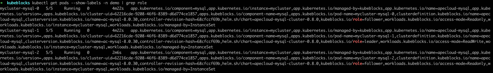
2. 删除 Leader 节点 `mycluster-mysql-1`，模拟节点故障。

    ```bash
    kubectl delete pod mycluster-mysql-1 -n demo
    ```

    
3. 检查 pod 状态和集群连接。

    此处示例显示 pod 角色发生变化。原 Leader 节点删除后，系统选出新的 Leader 为 `mycluster-mysql-0`。

    ```bash
    kubectl get pods --show-labels -n demo | grep role
    ```

    

    连接到该集群，检查 pod 角色和状态。该集群可在几秒内连接成功。

    ```bash
    kubectl get secrets -n demo mycluster-conn-credential -o jsonpath='{.data.\username}' | base64 -d
    >
    root

    kubectl get secrets -n demo mycluster-conn-credential -o jsonpath='{.data.\password}' | base64 -d
    >
    pt2mmdlp4

    kubectl exec -ti -n demo mycluster-mysql-0 -- bash

    mysql -uroot -pt2mmdlp4
    ```

    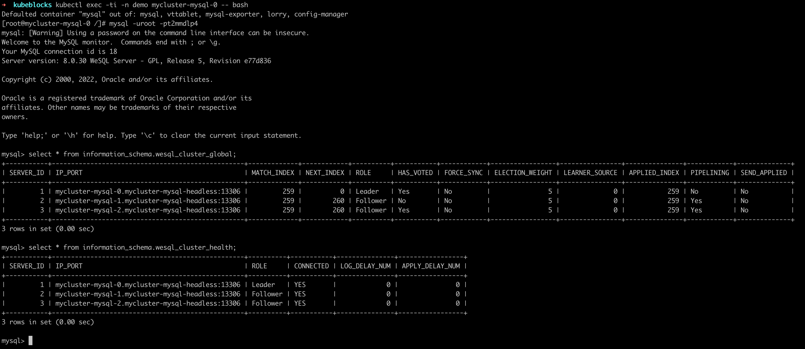

   ***自动恢复机制***

   Leader 节点删除后，ApeCloud MySQL 集群版会自行选主。上述示例中，选出新的 Leader 为 `mycluster-mysql-0`，KubeBlocks 探测到 Leader 角色发生变化，会发出通知，更新访问链路。原先异常节点会自动重建，恢复正常集群版状态。从异常开始到恢复完成，整体耗时正常在 30s 之内。

</TabItem>

</Tabs>

### 单个 Follower 节点异常

***步骤：***

<Tabs>

<TabItem value="kbcli" label="kbcli" default>

1. 查看 ApeCloud MySQL 集群版。

   在 `Topology` 中查看 Follower 节点的名称。在这个例子中，Follower 节点是 `mycluster-mysql-0` 和 `mycluster-mysql-2`。

    ```bash
    kbcli cluster describe mycluster -n demo
    ```

    

2. 删除 Follower 节点 `mycluster-mysql-0`。

    ```bash
    kubectl delete pod mycluster-mysql-0 -n demo
    ```

    

3. 查看集群状态，发现 Follower 节点处于 `Terminating` 状态。

    ```bash
    kbcli cluster describe mycluster -n demo
    ```

    

4. 连接到 MySQL 集群版，发现单个 Follower 的异常不影响集群的读写操作。

   ```bash
   kbcli cluster connect mycluster -n demo
   ```

   

</TabItem>

<TabItem value="kubectl" label="kubectl">

1. 查看 pod 角色，如下示例中 follower 节点为 `mycluster-mysql-1` and `mycluster-mysql-2`。

    ```bash
    kubectl get pods --show-labels -n demo | grep role
    ```

    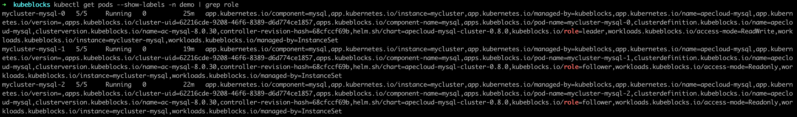
2. 删除 follower 节点 `mycluster-mysql-1`。

    ```bash
    kubectl delete pod mycluster-mysql-1 -n demo
    ```

    
3. 打开一个新的终端窗口，查看 pod 状态。可以发现 follower 节点 `mycluster-mysql-1` 处于 `Terminating` 状态。

    ```bash
    kubectl get pod -n demo
    ```

    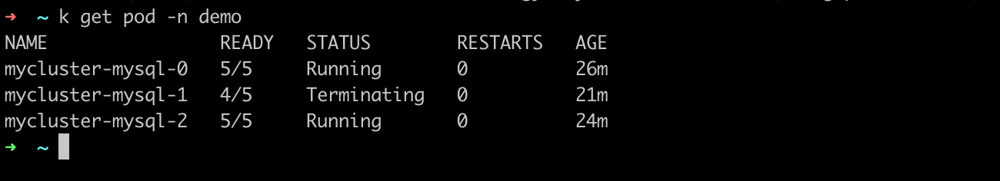

    再次查看 pod 角色。

    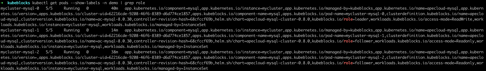

4. 连接集群，发现单个 Follower 节点异常不影响集群的读写操作。

    ```bash
    kubectl exec -ti -n demo mycluster-mysql-0 -- bash

    mysql -uroot -pt2mmdlp4
    ```

    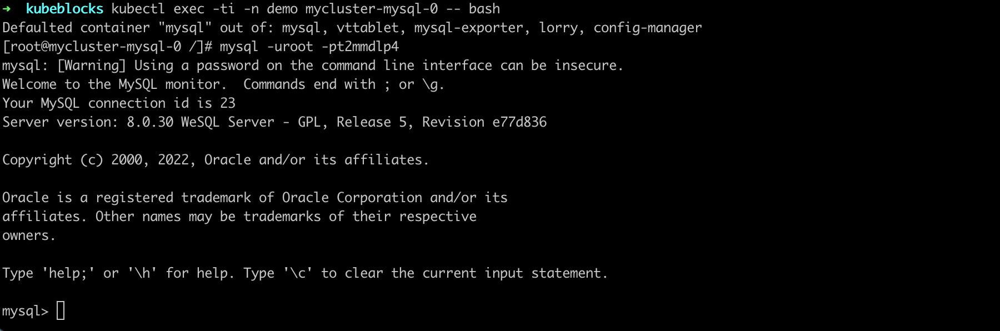

</TabItem>

</Tabs>

***自动恢复机制***

这是因为单个 Follower 节点异常不会触发角色重新选主，也不会切换访问链路，所以集群读写不受影响，Follower 异常后会自动触发重建，恢复正常，整体耗时在 30 秒内。

### 两个节点异常

集群可用的前提是多数节点状态正常，当多数节点异常时，原 Leader 节点将自动降级为 Follower 节点。因此，任意两个节点异常都会导致最后仅存一个 Follower 节点。所以，无论是一个 Leader 和一个 Follower 发生异常，还是两个 Follower 发生异常，其故障表现和自动恢复情况都是一样的。

***步骤：***

<Tabs>

<TabItem value="kbcli" label="kbcli" default>

1. 查看 ApeCloud MySQL 集群版。

   在 `Topology` 中查看 Follower 节点的名称。在这个例子中，Follower 节点是 `mycluster-mysql-0` 和 `mycluster-mysql-2`。

    ```bash
    kbcli cluster describe mycluster -n demo
    ```

    
2. 删除两个 Follower 节点。

    ```bash
    kubectl delete pod mycluster-mysql-1 mycluster-mysql-0
    ```

    
3. 查看 MySQL 集群版状态，发现集群自动选举出了新的 Leader 节点。

    ```bash
    kbcli cluster describe mycluster -n demo
    ```

    
4. 几秒钟后再次执行连接集群命令，数据库连接恢复正常。

    ```bash
    kbcli cluster connect mycluster -n demo
    ```

    

</TabItem>

<TabItem value="kubectl" label="kubectl">

1. 查看 Pod 状态。如下示例中，follower 节点为 `mycluster-mysql-1` 和 `mycluster-mysql-2`。

    ```bash
    kubectl get pods --show-labels -n demo | grep role
    ```

    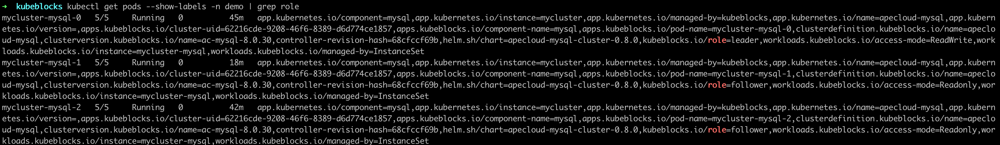
2. 删除两个 follower 节点。

    ```bash
    kubectl delete pod mycluster-mysql-1 mycluster-mysql-2 -n demo
    ```

    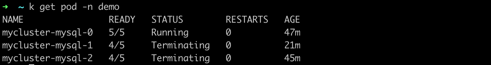
3. 打开一个新的终端窗口，查看 pod 状态，发现两个 follower 节点 `mycluster-mysql-1` 和 `mycluster-mysql-2` 都处于 `Terminating` 状态。

    ```bash
    kubectl get pod -n demo
    ```

    

    查看节点角色，发现已选举产生新的 leader。

    ```bash
    kubectl get pods --show-labels -n demo | grep role
    ```

    

4. 稍等几秒后，连接集群，发现集群中的 pod 在此正常运行。

    ```bash
    kubectl exec -ti -n demo mycluster-mysql-0 -- bash

    mysql -uroot -pt2mmdlp4
    ```

    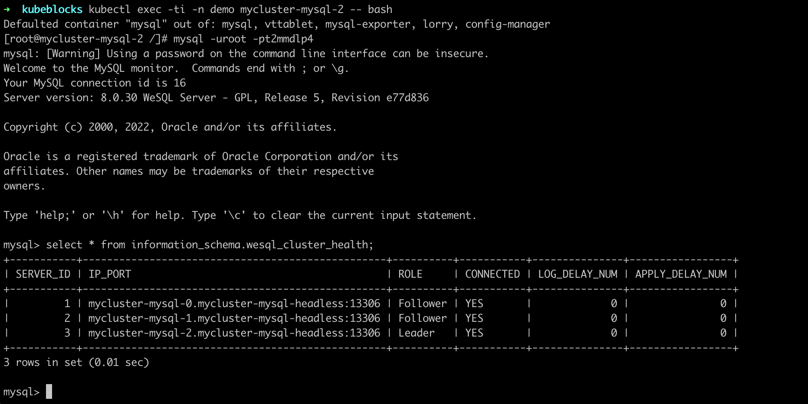

</TabItem>

</Tabs>

***自动恢复机制***

这是因为当 ApeCloud MySQL 两个节点异常时，满足多数节点不可用，导致 Leader 节点会自动降级为 Follower 节点，此时集群不可读写。待节点自动重建完成后，集群重新选出 Leader 节点恢复到可读写状态。整体耗时在 30 秒内。

### 所有节点异常

***步骤：***

<Tabs>

<TabItem value="kbcli" label="kbcli" default>

1. 查看 ApeCloud MySQL 集群版。

   在 `Topology` 中查看节点名称。

    ```bash
    kbcli cluster describe mycluster -n demo
    ```

    
2. 删除所有节点。

    ```bash
    kubectl delete pod mycluster-mysql-1 mycluster-mysql-0 mycluster-mysql-2 -n demo
    ```

    
3. 查看集群状态，发现节点角色发生改变。

    ```bash
    kbcli cluster describe mycluster -n demo
    ```

    
4. 几秒钟后再次执行 `kbcli cluster connect mycluster`，数据库连接恢复正常。

    ```bash
    kbcli cluster connect mycluster -n demo
    ```

    

</TabItem>

<TabItem value="kubectl" label="kubectl">

1. 查看节点角色。

    ```bash
    kubectl get pods --show-labels -n demo | grep role
    ```

    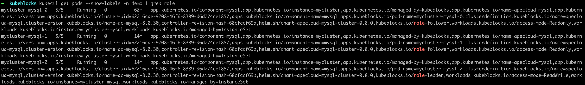
2. 删除所有节点。

    ```bash
    kubectl delete pod mycluster-mysql-1 mycluster-mysql-0 mycluster-mysql-2 -n demo
    ```

    
3. 打开一个新的终端窗口，查看 pod 状态，发现所有 pod 均处于 `Terminating` 状态。

    ```bash
    kubectl get pod -n demo
    ```

    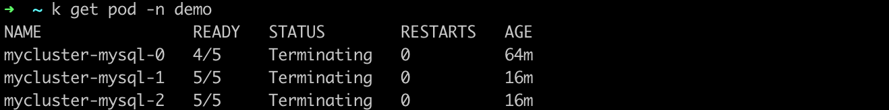
4. 再次查看节点角色，发现已选举产生新的 leader。

    ```bash
    kubectl get pods --show-labels -n demo | grep role
    ```

    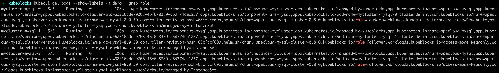
5. 稍等几秒后，连接集群，发现集群中的 pod 已恢复正常运行。

    ```bash
    kubectl exec -ti -n demo mycluster-mysql-0 -- bash

    mysql -uroot -pt2mmdlp4
    ```

    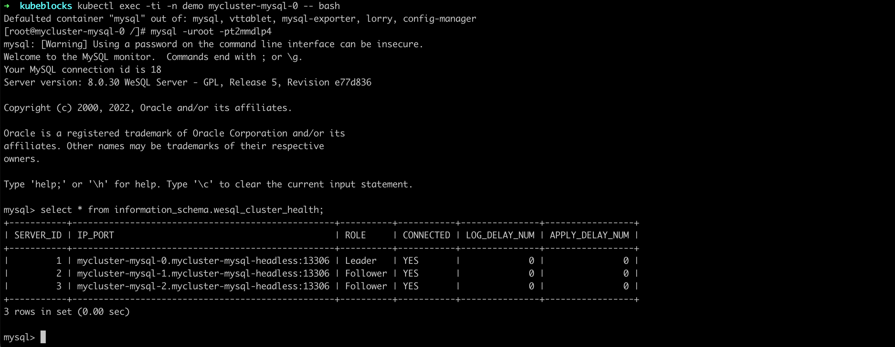

</TabItem>

</Tabs>

***自动恢复机制***

这是因为节点删除后，都会自动触发重建，然后 ApeCloud MySQL 会自动完成集群恢复及选主。选主完成后，Kubeblocks 会探测新 Leader，并更新访问链路，恢复可用。整体耗时在 30 秒内。
