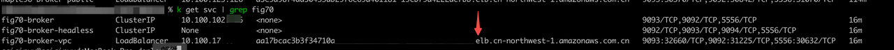
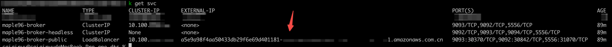

import Tabs from '@theme/Tabs';
import TabItem from '@theme/TabItem';

# 连接到 Kafka 集群

## 概述

在连接 Kafka 集群之前，请检查网络环境，并确认连接场景。一般来说，有三种连接场景：

- 在 Kubernetes 集群内连接到 Kafka 集群。
- 在 Kubernetes 集群外同一 VPC 下连接到 Kafka 集群
- 在公共互联网连接到 Kafka 集群。

## 在 Kubernetes 集群内连接到 Kafka 集群

通过直连 Kafka 集群的 ClusterIP service:9092 访问。

***步骤：***

1. 获取 Kafka ClusterIP 服务的地址和端口号。

   ```bash
   kubectl get svc 
   ```

   *示例:*

   ```bash
   NAME                    TYPE        CLUSTER-IP    EXTERNAL-IP   PORT(S)                               AGE
   kubernetes              ClusterIP   10.43.0.1     <none>        443/TCP                               9d
   ivy85-broker-headless   ClusterIP   None          <none>        9092/TCP,9093/TCP,9094/TCP,5556/TCP   7d16h
   ivy85-broker            ClusterIP   10.43.8.124   <none>        9093/TCP,9092/TCP,5556/TCP            7d16h
   ```

2. 使用端口号连接到 Kafka 集群。

   下面展示如何使用官方客户端脚本连接 Kafka 集群。

   a. 启动客户端 Pod。

     ```bash
     kubectl run kafka-producer --restart='Never' --image docker.io/bitnami/kafka:3.3.2-debian-11-r54 --command -- sleep infinity
     kubectl run kafka-consumer --restart='Never' --image docker.io/bitnami/kafka:3.3.2-debian-11-r54 --command -- sleep infinity
     ```

   b. 登录 kafka-producer。

     ```bash
     kubectl exec -ti kafka-producer -- bash
     ```

   c. 创建 topic。

     ```bash
     kafka-topics.sh --create --topic quickstart-events --bootstrap-server xxx-broker:9092
     ```

   d. 创建 producer。

     ```bash
     kafka-console-producer.sh --topic quickstart-events --bootstrap-server xxx-broker:9092 
     ```

   e. 输入：Hello, KubeBlocks，然后按 Enter 键。

   f. 打开新的终端窗口并登录到 kafka-consumer。

     ```bash
     kubectl exec -ti kafka-consumer -- bash
     ```

   g. 创建 consumer，指定消费 topic 和从开头开始消费消息。

     ```bash
     kafka-console-consumer.sh --topic quickstart-events --from-beginning --bootstrap-server xxx-broker:9092
     ```

然后将得到输出 'Hello, KubeBlocks'。

## 在 Kubernetes 集群外同一 VPC 下连接到 Kafka 集群

许多使用 AWS EKS 的用户希望能从 EC2 实例访问 Kafka 集群，本节将展示具体操作步骤。

***步骤：***

1. 将 host-network-accessible 的值设置为 true。

    <Tabs>
    <TabItem value="kbcli" label="kbcli" default>

    ```bash
    kbcli cluster create kafka --host-network-accessible=true
    ```

    </TabItem>
    <TabItem value="kubectl" label="kubectl" >

    ```bash
    kubectl apply -f - <<EOF
    apiVersion: apps.kubeblocks.io/v1alpha1
    kind: Cluster
    metadata:
      name: kafka
      namespace: default
    spec:
      affinity:
        podAntiAffinity: Preferred
        tenancy: SharedNode
        topologyKeys:
        - kubernetes.io/hostname
      clusterDefinitionRef: kafka
      clusterVersionRef: kafka-3.3.2
      componentSpecs:
      - componentDefRef: kafka-server
        monitor: false
        name: broker
        replicas: 1
        resources:
          limits:
            cpu: "1"
            memory: 1Gi
          requests:
            cpu: "1"
            memory: 1Gi
        serviceAccountName: kb-sa-kafka
        services:
        - annotations: 
            service.beta.kubernetes.io/aws-load-balancer-type: nlb
            service.beta.kubernetes.io/aws-load-balancer-internal: "true"
          name: vpc
          serviceType: LoadBalancer
        tls: false
      terminationPolicy: Delete
    EOF
    ```

    </TabItem>

    </Tabs>

2. 获取相应的 ELB 地址。

   ```bash
   kubectl get svc 
   ```

   

   请注意：
   - a0e01377fa33xxx-xxx.cn-northwest-1.elb.amazonaws.com.cn 是 Kubernetes 外部同一 VPC 下能访问的 ELB 地址。

3. 使用 ELB 地址进行连接。

    在上例中，ELB 地址为 a0e01377fa33xxx-xxx.cn-northwest-1.elb.amazonaws.com.cn:9092。

## 在公共互联网连接到 Kafka 集群

***步骤：***

1. 将 `--publicly-accessible` 的值设置为 true。

    <Tabs>
    <TabItem value="kbcli" label="kbcli" default>

    ```bash
    kbcli cluster create kafka --publicly-accessible=true
    ```

    </TabItem>

    <TabItem value="kubectl" label="kubectl" >

    ```bash
    kubectl apply -f - <<EOF
    apiVersion: apps.kubeblocks.io/v1alpha1
    kind: Cluster
    metadata:
      name: kafka
      namespace: default
    spec:
      affinity:
        podAntiAffinity: Preferred
        tenancy: SharedNode
        topologyKeys:
        - kubernetes.io/hostname
      clusterDefinitionRef: kafka
      clusterVersionRef: kafka-3.3.2
      componentSpecs:
      - componentDefRef: kafka-server
        monitor: false
        name: broker
        replicas: 1
        resources:
          limits:
            cpu: "1"
            memory: 1Gi
          requests:
            cpu: "1"
            memory: 1Gi
        serviceAccountName: kb-sa-kafka
        services:
        - annotations: 
            service.beta.kubernetes.io/aws-load-balancer-type: nlb
            service.beta.kubernetes.io/aws-load-balancer-internal: "false"
          name: vpc
          serviceType: LoadBalancer
        tls: false
      terminationPolicy: Delete
    EOF
    ```

    </TabItem>

    </Tabs>

2. 获取实例对应的 ELB 地址。

   ```bash
   kubectl get svc
   ```

   

   请注意：
   - xxxx-xxxx.cn-northwest-1.elb.amazonaws.com.cn 是公网下能访问的 ELB 地址。

3. 配置 hostname 映射。
   1. 登陆远程机器。
   2. 查看 ELB 地址 IP。

      ```bash
      nslookup a96caad7bab59xxxx-xxxx.cn-northwest-1.elb.amazonaws.com.cn
      ```

   3. 获取 Broker 地址。

      Broker 地址为固定格式，将下面字符串中 `{clusterName}` 替换成 Kafka Cluster Name 即可。

      ```bash
      {clusterName}-broker-0.{clusterName}-broker-headless.default.svc
      ```

   4. 配置 /etc/hosts 映射。

       ```bash
       vi /etc/hosts
       # 最下方添加,注意将{clusterName}和ip地址替换成真实的值：
       52.83.xx.xx {clusterName}-broker-0.{clusterName}-broker-headless.default.svc
       ```

4. 使用 ELB 地址进行连接。

    在上例中，ELB 地址为 xxxx-xxxx.cn-northwest-1.elb.amazonaws.com.cn:9092。
