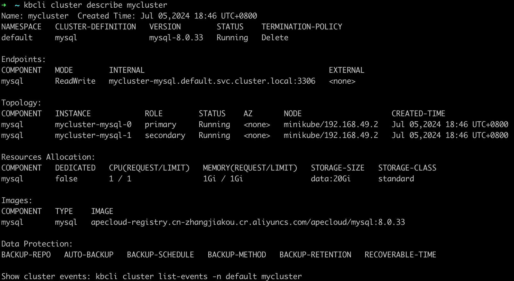
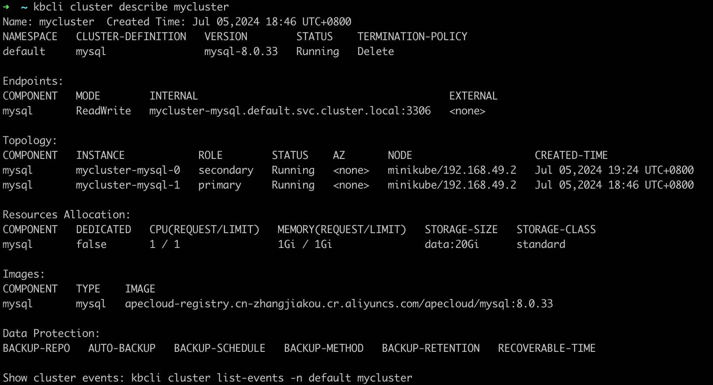
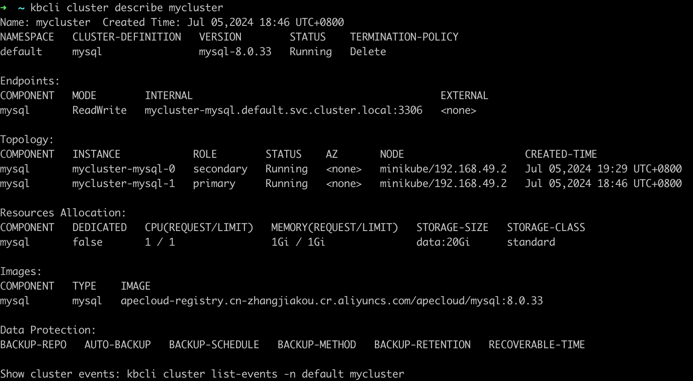
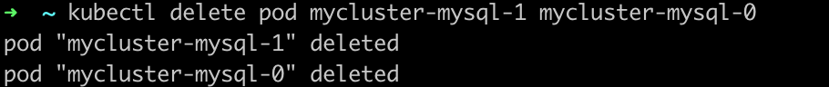
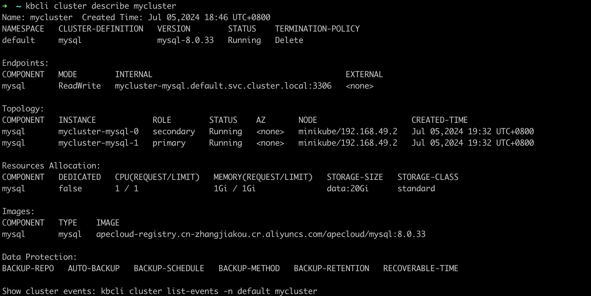

# 故障模拟与自动恢复

作为一个开源数据管理平台，Kubeblocks目前支持三十多种数据库引擎，并且持续扩展中。由于这些数据库本身的高可用能力是参差不齐的，因此KubeBlocks设计实现了一套高可用系统用于保障数据库实例的高可用能力。KubeBlocks高可用系统采用了统一的HA框架设计，实现对数据库的高可用支持，使得不同的数据库在KubeBlocks上可以获得类似的高可用能力和体验。

下面以 MySQL 社区版为例，演示它的故障模拟和恢复能力。

## 故障恢复

:::note

下面通过删除 Pod 来模拟故障。在资源充足的情况下，也可以通过机器宕机或删除容器来模拟故障，其自动恢复过程与本文描述的相同。

:::

### 开始之前

* [安装 KubeBlocks](./../../installation/install-with-kbcli/install-kubeblocks-with-kbcli.md)。
* 创建 MySQL 主备版集群，详情可参考 [创建 MySQL 集群](./../cluster-management/create-and-connect-a-mysql-cluster.md)。
* 执行 `kubectl get cd mysql -o yaml` 检查 MySQL 集群版是否已启用 _rolechangedprobe_（默认情况下是启用的）。如果出现以下配置信息，则表明已启用：

  ```bash
  probes:
    roleProbe:
      failureThreshold: 2
      periodSeconds: 1
      timeoutSeconds: 1
  ```

### 主节点异常

***步骤：***

1. 查看集群信息。可在 `Topology` 中查看主节点的名称，在如下例子中，主节点为 `mycluster-mysql-0`。

    ```bash
    kbcli cluster describe mycluster
    ```

    
2. 删除主节点 `mycluster-mysql-0`，模拟节点故障。

    ```bash
    kubectl delete pod mycluster-mysql-0
    ```

    
3. 执行命令，查看 pod 状态和集群连接。

    ***Results***

    此处示例显示 pod 角色发生变化。原主节点删除后，系统选出新的主节点为 `mycluster-mysql-1`。

    ```bash
    kbcli cluster describe mycluster
    ```

    

    MySQL 主备版集群可在几秒钟连接。

   ***自动恢复机制***

   这是因为主节点删除后，MySQL 主备版会自行选主，选出新的主节点为 `mysql-cluster-mysql-0`，KubeBlocks 探测到主角点角色发生变化，会发出通知，更新访问链路。原先异常节点会自动重建，恢复正常主备集群状态。从异常开始到恢复完成，整体耗时在 30 秒内。

### 备节点异常

***步骤：***

1. 查看集群信息。可在 `Topology` 中查看备节点的名称，在如下例子中，备节点为 `mycluster-mysql-0`。

    ```bash
    kbcli cluster describe mycluster
    ```

    
2. 删除备节点 `mycluster-mysql-0`。

    ```bash
    kubectl delete pod mycluster-mysql-0
    ```

    
3. 查看集群状态，可在 `Component.Instance` 看到备节点处于终止状态。

    ```bash
    kbcli cluster describe mycluster
    ```

    

   ***自动恢复机制***

   这是因为单个备节点异常不会触发角色重新选主，也不会切换访问链路，所以集群读写不受影响，备节点异常后会自动触发重建，恢复正常，整体耗时在 30 秒内。

### 两个节点异常

***步骤：***

1. 查看集群信息，在 `Topology` 中查看节点名称。

    ```bash
    kbcli cluster describe mycluster
    ```

    
2. 删除所有节点。

    ```bash
    kubectl delete pod mycluster-mysql-1 mycluster-mysql-0
    ```

    
3. 查看删除任务进展，发现所有节点都处于 pending 状态，几秒后恢复正常。

    ```bash
    kbcli cluster describe mycluster
    ```

    

   ***自动恢复机制***

   这是因为节点删除后，都会自动触发重建，然后 MySQL 会自动完成集群恢复及选主。选主完成后，Kubeblocks 会探测新的主节点，并更新访问链路，恢复可用。整体耗时在 30 秒内。
