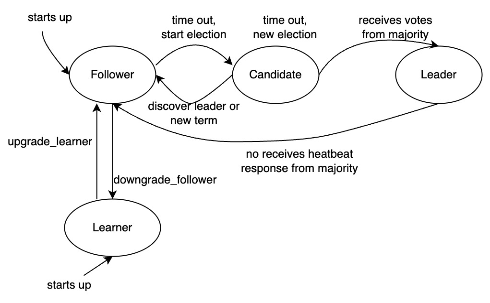

# MySQL 简介

MySQL 是全球最流行的开源数据库，受到许多公司的欢迎，例如 Facebook、Twitter、Netflix、Uber、Airbnb、Shopify 和 Booking 等。

KubeBlocks 采用了 ApeCloud 公司提供的 MySQL 高可用版本，做了数据压缩和高可用性方面的改进。

- 当节点数大于等于 3 个时，通过一致性算法协议构成强一致高可用性集群，确保在单可用区故障的情况下 RPO=0。其中，主节点提供读写能力，其余节点提供只读服务。
- 当节点数等于 2 时，构成主备复制集群，其中主节点提供读写能力，备节点通过异步复制与主节点保持同步，提供只读服务和故障容灾能力。
- 当节点数等于 1 时，构成单节点集群，提供读写服务。KubeBlocks 仍然提供自动恢复能力，在云盘不损坏的情况下保证 RPO=0。

## 实例角色

ApeCloud MySQL 支持四种角色类型，即 **Leader**（领导者）、**Follower**（跟随者）、**Candidate**（候选者）和 **Learner**（学习者）。Leader 和 Follower 组成高可用性集群，提供 RPO=0 能力。

- Leader：Leader 是集群的主实例，支持读写操作，是集群强一致节点。由所有参与选举的 Candidate 投票产生。得票数最多的 Candidate 成为 Leader，其他的成为 Follower。
- Follower：Follower 支持数据一致性只读服务，并与 Leader 和其他 Follower 组成高可用性集群。
- Learner：Learner 通常用于跨地域的一致性只读数据节点实例，通过 Paxos 协议实现数据同步，数据同步源可以是 Leader 或 Follower。Learner 是一致性算法协议中的特殊角色，不参与投票，也不成为 Candidate，类似旁听角色。
- Candidate：Candidate 是一个中间角色，只在选举过程或无法形成多数派选出 Leader 时存在。一般来说，高可用集群中的所有 Candidate 在选举完成后，最终都会成为 Leader 或 Follower 角色。

| 角色类型 | Leader | Follower | Learner | Candidate |
| --- | --- | --- | --- | --- |
| 功能能力 | RW/HA | RO/HA | RO | - |

### 故障切换

故障切换将重定向流量，把正在执行的任务从主节点切换到从节点。

### 只读功能

节点提供只读能力。除了 Follower 角色之外，还可以通过添加 Learner 角色来扩展集群的只读能力。需要注意的是，通过 Follower 或 Learner 执行只读操作时，可能会与 Leader 存在数据延迟。这种延迟可能是由于日志同步延迟或日志回放延迟导致的。

### 容错性

集群具备节点故障容错能力。在 n 个节点集群下，可以容忍的故障节点数为 `floor(n/2) + 1，其中 n=[1,99]`，满足 Paxos 算法协议的要求。基于此，可以得出在指定可容忍节点故障数为 f 的情况下，需要创建的节点数为 n=2*f+1，其中 f>=0。例如，如果可容忍的故障节点数为 1，则根据公式可知，集群中的最小节点数为 3。即，在一个 Paxos 组中，能够保证具有 1 个故障节点下集群的持续服务能力。根据下表可以看出，创建奇数个节点集群更具性价比。

| 集群节点数 | 节点大多数 | 可容忍故障节点数 |
| --- | --- | --- |
| 3 | 2 | 1 |
| 4 | 3 | 1 |
| 5 | 3 | 2 |
| 6 | 4 | 2 |
| 7 | 4 | 3 |
| 8 | 5 | 3 |
| 9 | 5 | 4 |
| 10 | 6 | 4 |

