# 故障模拟与自动恢复

作为开源的数据管理平台，KubeBlocks 支持两种数据库形态：ReplicationSet 和 ConsensusSet。ReplicationSet 用于一主多从，非自动切换数据库管理，例如 MySQL 和 Redis 等。ConsensusSet 可用于多副本、具备自动切换能力的数据库管理，例如 ApeCloud MySQL 集群版和 MongoDB 等。目前，Kubeblocks v0.3.0 版本已发布 ConsensusSet 数据库管理能力，而 ReplicationSet 正在开发中。

本文档以 ApeCloud MySQL 为例，介绍 ConsensusSet 形态下数据库的高可用能力，该能力也适用于其它数据库引擎。

## 故障恢复

:::note

下面通过删除 Pod 来模拟故障。在资源充足的情况下，也可以通过机器宕机或删除容器来模拟故障，其自动恢复过程与本文描述的相同。

:::

### 开始之前

* 安装 KubeBlocks：可使用 [kbcli](./../../installation/install-with-kbcli/install-kubeblocks-with-kbcli.md) 或 [Helm](./../../installation/install-with-helm/install-kubeblocks-with-helm.md) 安装。
* 创建一个 ApeCloud MySQL 集群版，详情可参考[创建 MySQL 集群](./../cluster-management/create-and-connect-a-mysql-cluster.md)。
* 执行 `kubectl get cd apecloud-mysql -o yaml` 检查 ApeCloud MySQL 集群版是否已启用 _rolechangedprobe_（默认情况下是启用的）。如果出现以下配置信息，则表明已启用：

  ```bash
  probes:
    roleProbe:
      failureThreshold: 3
      periodSeconds: 2
      timeoutSeconds: 1
  ```

### Leader 节点异常

***步骤：***

1. 查看 ApeCloud MySQL 集群版。
   在 `Topology` 中查看 Leader 节点的名称。在这个例子中，Leader 节点为 `mysql-cluster-mysql-1`。

    ```bash
    kbcli cluster describe mysql-cluster
    ```

    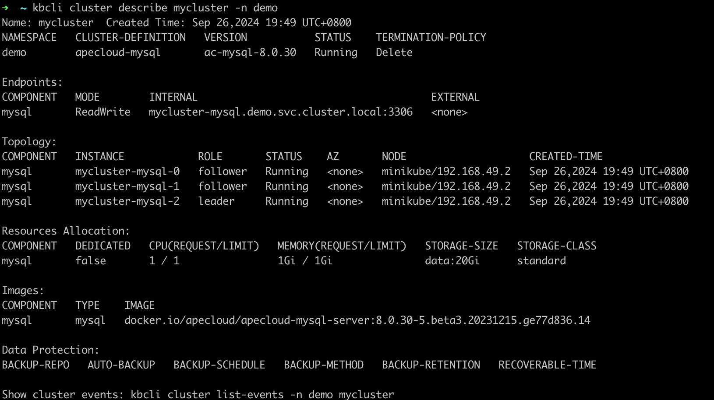
2. 删除 Leader 节点 `mysql-cluster-mysql-1`，模拟节点故障。

    ```bash
    kubectl delete pod mysql-cluster-mysql-1
    ```

    
3. 查看集群状态，发现 Leader 节点发生变化。
   这是因为 Leader 节点删除后，ApeCloud MySQL 集群版会自行选主，选出新的 Leader 为 `mysql-cluster-mysql-2`，KubeBlocks 探测到 Leader 角色发生变化，会发出通知，更新访问链路。原先异常节点会自动重建，恢复正常三节点状态。从异常开始到恢复完成，整体耗时在 30 秒内。

    ```bash
    kbcli cluster describe mysql-cluster
    ```

    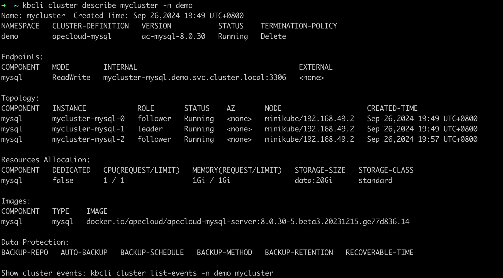

4. 几秒钟后再次执行 `kbcli cluster connect mysql-cluster`，数据库连接恢复正常。

    ```bash
    kbcli cluster connect mysql-cluster
    ```

    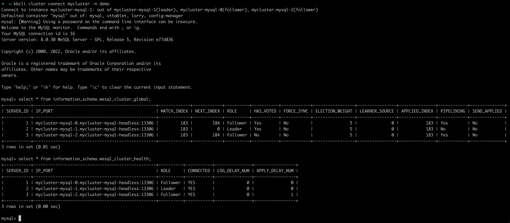

### 单个 Follower 节点异常

***步骤：***

1. 查看 ApeCloud MySQL 集群版。
   在 `Topology` 中查看 Follower 节点的名称。在这个例子中，Follower 节点是 `mysql-cluster-mysql-0` 和 `mysql-cluster-mysql-1`。

    ```bash
    kbcli cluster describe mysql-cluster
    ```

    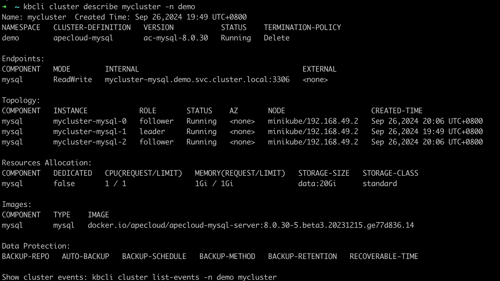

2. 删除 Follower 节点 `mysql-cluster-mysql-0`。

    ```bash
    kubectl delete pod mysql-cluster-mysql-0
    ```

    

3. 连接到 MySQL 集群版，发现单个 Follower 的异常不影响集群的读写操作。

    ```bash
    kbcli cluster connect mysql-cluster
    ```

    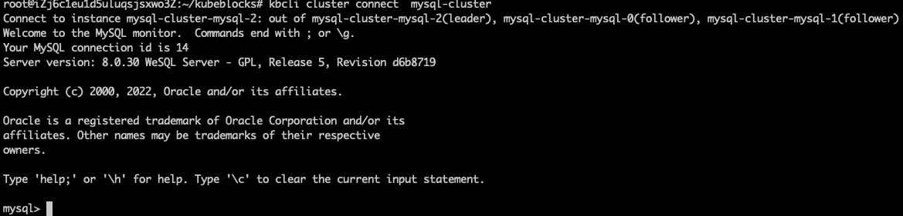

4. 再次查看集群状态，节点角色与故障前相同。
   这是因为单个 Follower 节点异常不会触发角色重新选主，也不会切换访问链路，所以集群读写不受影响，Follower 异常后会自动触发重建，恢复正常，整体耗时在 30 秒内。

   ```bash
   kbcli cluster describe mysql-cluster
   ```

   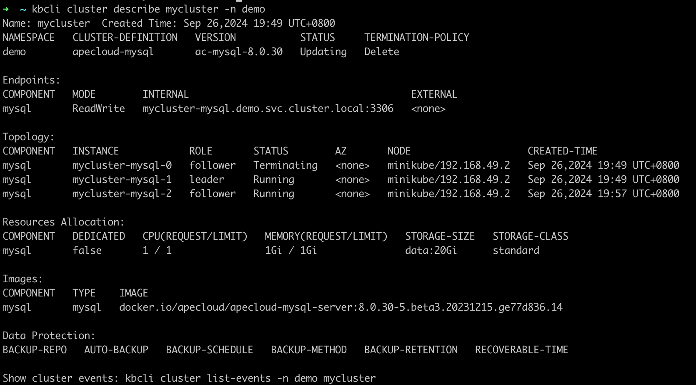

### 两个节点异常

集群可用的前提是多数节点状态正常，当多数节点异常时，原 Leader 节点将自动降级为 Follower 节点。因此，任意两个节点异常都会导致最后仅存一个 Follower 节点。所以，无论是一个 Leader 和一个 Follower 发生异常，还是两个 Follower 发生异常，其故障表现和自动恢复情况都是一样的。

***步骤：***

1. 查看 ApeCloud MySQL 集群版。
   在 `Topology` 中查看 Follower 节点的名称。在这个例子中，Follower 节点是 `mysql-cluster-mysql-0` 和 `mysql-cluster-mysql-1`。

    ```bash
    kbcli cluster describe mysql-cluster
    ```

    
2. 删除两个 Follower 节点。

    ```bash
    kubectl delete pod mysql-cluster-mysql-1 mysql-cluster-mysql-0
    ```

    
3. 查看 MySQL 集群版状态，发现集群自动选举出了新的 Leader 节点。
   这是因为当 ApeCloud MySQL 两个节点异常时，满足多数节点不可用，导致 Leader 节点会自动降级为 Follower 节点，此时集群不可读写。待节点自动重建完成后，集群重新选出 Leader 节点恢复到可读写状态。整体耗时在 30 秒内。

    ```bash
    kbcli cluster describe mysql-cluster
    ```

    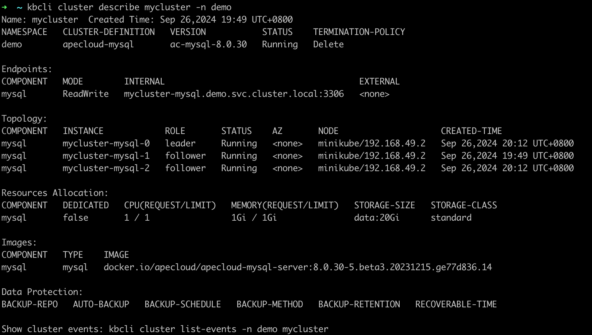
4. 几秒钟后再次执行 `kbcli cluster connect mysql-cluster`，数据库连接恢复正常。

    ```bash
    kbcli cluster connect mysql-cluster
    ```

    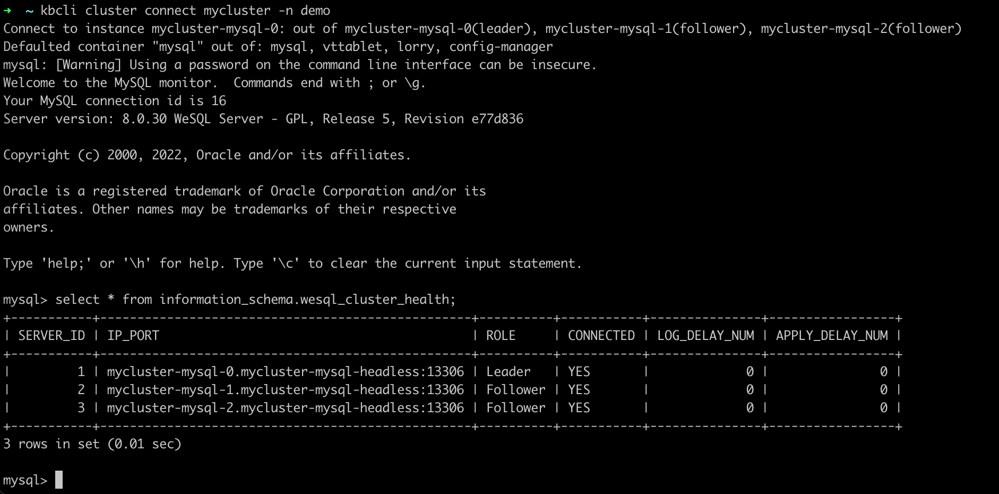

### 所有节点异常

***步骤：***

1. 查看 ApeCloud MySQL 集群版。
   在 `Topology` 中查看节点名称。

    ```bash
    kbcli cluster describe mysql-cluster
    ```

    
2. 删除所有节点。

    ```bash
    kubectl delete pod mysql-cluster-mysql-1 mysql-cluster-mysql-0 mysql-cluster-mysql-2
    ```

    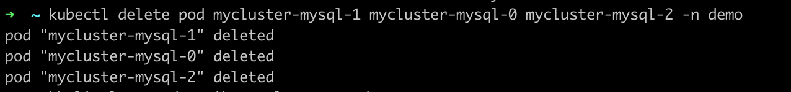
3. 查看集群状态，发现节点角色发生改变。
   这是因为节点删除后，都会自动触发重建，然后 ApeCloud MySQL 会自动完成集群恢复及选主。选主完成后，Kubeblocks 会探测新 Leader，并更新访问链路，恢复可用。整体耗时在 30 秒内。

    ```bash
    kbcli cluster describe mysql-cluster
    ```

    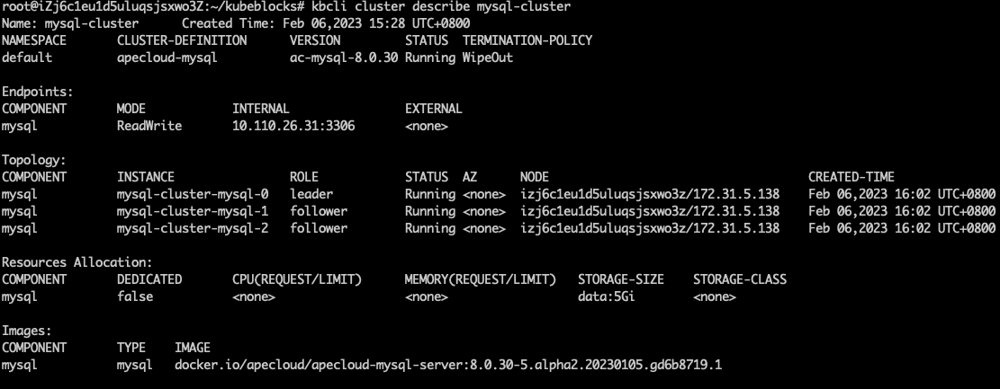
4. 几秒钟后再次执行 `kbcli cluster connect mysql-cluster`，数据库连接恢复正常。

    ```bash
    kbcli cluster connect mysql-cluster
    ```

    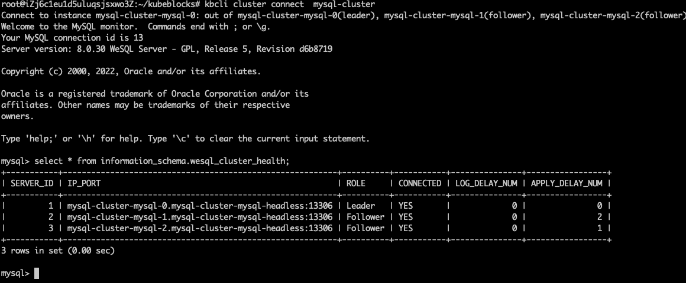
