# 通过 AWS DMS 将数据迁移到 ApeCloud MySQL

:::note

* 使用公共网络和网络负载均衡器可能会产生费用。
* 本文档适用于在 AWS EKS 上部署 ApeCloud MySQL 的情况。使用其他 Kubernetes 集群部署 ApeCloud MySQL 不适用于本文档。

:::

## 网络配置

### 暴露目标 ApeCloud MySQL 网络

在 EKS 环境中，ApeCloud MySQL 的 Kubernetes ClusterIP 默认是暴露的。由于 DMS（数据库迁移服务）的迁移任务是在独立的 Replication Instance 中运行的，虽然可以设置与 Kubernetes 集群使用相同的 VPC，但访问 ClusterIP 仍然会失败。这个解决方案旨在连接此部分网络。

#### KubeBlocks 自带解决方案

***开始之前***

* [安装 kbcli](./../../installation/install-with-kbcli/install-kbcli.md)。
*  安装 KubeBlocks: 你可以用 [kbcli](./../../installation/install-with-kbcli/install-kubeblocks-with-kbcli.md) 或 [Helm](./../../installation/install-with-helm/install-kubeblocks-with-helm.md) 进行安装。
* 开启 AWS Load Balancer Controller 插件。

   ```bash
   kbcli addon list

   kbcli addon enable aws-load-balancer-controller
   >
   addon.extensions.kubeblocks.io/aws-load-balancer-controller enabled
   ```

   负载均衡器插件依赖于 EKS 环境，如果负载均衡器未成功开启，可能与环境有关。

   检查 EKS 环境并重新启用此插件。详情请参阅[引擎文档](./../../overview/database-engines-supported.md)。

***步骤***

1. 在 AWS 上创建 ApeCloud MySQL 集群。详情请参阅[创建并连接 MySQL 集群](./../../kubeblocks-for-mysql/cluster-management/create-and-connect-a-mysql-cluster.md)。
2. 填写集群名称，并执行以下命令暴露集群的外部 IP。

   ```bash
   kbcli cluster expose mysql-cluster --enable=true --type='vpc'
   ```

   :::note

   在 `kbcli cluster expose` 命令中，`--type` 的可用值为 `vpc` 和 `internet`。对于同一 VPC 内的访问，请使用 `--type=vpc`；如果是公共网络下的跨 VPC 访问，请使用 `--type=internet`。

   :::

   执行以下命令，查看到外部 IP:Port 地址，该地址可以被 EKS 集群外的同一 VPC 的机器访问。

   ```bash
   kbcli cluster describe mysql-cluster | grep -A 3 Endpoints
   >
   Endpoints:
   COMPONENT       MODE            INTERNAL                EXTERNAL
   mysql           ReadWrite       10.100.51.xxx:3306      172.31.35.xxx:3306 
   ```

3. 将外部 IP: Port 配置为 AWS DMS 上的目标终端节点。

   此操作将在 EC2 上生成一个 ENI（弹性网络接口）。如果低规格机型的 Quota 较小，请注意 ENI 的可用水位。

   有关EC2 机型对应的 ENI 规格，请参阅[弹性网络接口](https://docs.aws.amazon.com/zh_cn/AWSEC2/latest/UserGuide/using-eni.html)。

#### 使用 Network Load Balancer (NLB) 暴露服务

1. 在 EKS 集群上安装 AWS Load Balancer Controller。

   详情请参考 [安装 AWS Load Balancer Controller 附加组件](https://docs.aws.amazon.com/eks/latest/userguide/aws-load-balancer-controller.html)。

   在集群中创建 NLB 请参考 [Amazon EKS 上的网络负载均衡](https://docs.aws.amazon.com/eks/latest/userguide/network-load-balancing.html)。
2. 创建使用 NLB 的服务，暴露 ApeCloud MySQL 服务。

   根据实际环境配置 `metadata.name`、`metadata.annotations`、`metadata.labels` 和 `spec.selector`。

   ```yaml
   cat <<EOF | kubectl apply -f -
   kind: Service
   apiVersion: v1
   metadata:
       name: apecloud-mysql-service
       annotations:
           service.beta.kubernetes.io/aws-load-balancer-type: nlb-ip
           alb.ingress.kubernetes.io/scheme: internet-facing
           service.beta.kubernetes.io/aws-load-balancer-subnets: <subnet name1>,<subnet name2>
       labels:
         apps.kubeblocks.io/component-name: mysql
         app.kubernetes.io/instance: <apecloud-mysql clustername>
         app.kubernetes.io/managed-by: kubeblocks
         app.kubernetes.io/name: apecloud-mysql     
   spec:
       externalTrafficPolicy: Cluster 
       type: LoadBalancer
       selector:
         apps.kubeblocks.io/component-name: mysql
         app.kubernetes.io/instance: <apecloud-mysql clustername>
         app.kubernetes.io/managed-by: kubeblocks
         kubeblocks.io/role: leader
       ports:
           - name: http
             protocol: TCP
             port: 3306
             targetPort: mysql 
   EOF
   ```

3. 检查新服务和 NLB 是否正常运行。

   ```bash
   kubectl get svc 
   >
   NAME                           TYPE           CLUSTER-IP       EXTERNAL-IP                                        PORT(S)  
   apecloud-mysql-service         LoadBalancer   10.100.xx.xx     k8s-xx-xx-xx.elb.cn-northwest-1.amazonaws.com.cn   3306:xx/TCP
   ```

   确保服务器正常运行并能够生成 EXTERNAL-IP。同时，通过 AWS 控制台验证 NLB 状态是否为 `Active`，随后即可通过 EXTERNAL-IP:Port 访问集群。

   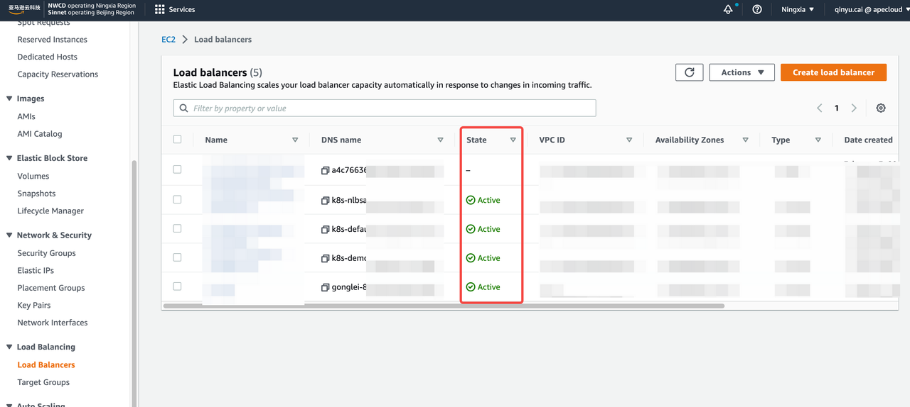

### 暴露源端网络

共有四种不同的源网络条件，请根据实际情况选择一种暴露源端网络。

* 阿里云 RDS
  
   使用公网。参考[该文档](https://help.aliyun.com/zh/rds/apsaradb-rds-for-mysql/apply-for-or-release-a-public-endpoint-for-an-apsaradb-rds-for-mysql-instance)开放公网访问，在 AWS DMS 创建 Endpoint 即可。

* AWS 同一 VPC 下 RDS
  
   在创建 DMS 终端节点时，只需指定一个 RDS，无需进行额外操作。

   创建终端节点可参考[配置 AWS DMS 任务](#配置-aws-dms-任务)中的第 2 步。

* AWS 不同 VPC 下 RDS

   使用公网来创建终端节点。参考[此文档](https://repost.aws/zh-Hans/knowledge-center/aurora-mysql-connect-outside-vpc)将集群配置为公网访问可用，然后在 AWS DMS 中创建一个终端节点。

   创建终端节点可参考[配置 AWS DMS 任务](#配置-aws-dms-任务)中的第 2 步。

* AWS EKS 中的 MySQL
  
   使用NLB暴露服务。

  1. 安装 Load Balancer Controller。

     安装详情请参考[安装 AWS Load Balancer Controller 附加组件](https://docs.aws.amazon.com/zh_cn/eks/latest/userguide/aws-load-balancer-controller.html)。

     在集群中创建 NLB 详情请参考 [Amazon EKS 上的网络负载均衡](https://docs.aws.amazon.com/zh_cn/eks/latest/userguide/network-load-balancing.html)。

  2. 使用 NLB 创建服务。

     确保 `metadata.labels` 中 `some.label.key` 的值与创建的 ApeCloud MySQL 的值一致。

     根据当前环境，配置 `spec.ports` 中的 `port` 和 `targetPort`。

     ```yaml
     cat <<EOF | kubectl apply -f -
     kind: Service
     apiVersion: v1
     metadata:
         name: mysql-local-service
         annotations:
             service.beta.kubernetes.io/aws-load-balancer-type: nlb-ip
             alb.ingress.kubernetes.io/scheme: internet-facing
             service.beta.kubernetes.io/aws-load-balancer-subnets: ${subnet name1},${subnet name2}
         labels:
         some.label.key: some-label-value    
     spec:
         externalTrafficPolicy: Cluster 
         type: LoadBalancer
         selector:
         some.label.key: some-label-value  
         ports:
             - name: http
               protocol: TCP
               port: 3306
               targetPort: 3306 
     EOF
     ```

  3. 确保 Service 和 NLB 正常运行。

     详情请参考[使用网络负载均衡器（NLB）暴露服务](#使用-network-load-balancer-nlb-暴露服务)中的第 3 步。

## 配置 AWS DMS 任务

在迁移过程中，请注意：

* 双写问题
  
   迁移期间，需要保证目标数据实例上没有业务写入，否则会出现数据问题.

* 目标实例磁盘空间问题
  
   由于传输工具写目标数据库时是并发写入模型，存在乱序写入的情况，可能会触发页分裂问题导致目标数据库的数据空间相比原实例的空间有些许放大。建议在分配目标数据库存储大小时可以适当多规划一些，比如至少有源数据库当前存储的 1.5 倍。

* DDL & onlineDDL 问题
  
   有锁结构变更往往会影响数据迁移的速度。

   而无锁结构变更，由于原理上是基于临时表 rename，在迁移对象不是整库迁移的前提下会导致数据问题。

   例如，如果迁移对象选择迁移 db1.table1 到目标，过程中在源数据库上针对 db1.table1 做了一次 onlineDDL，那么目标数据库上的 db1.table1 的数据将和源数据库不一致。

   需要注意的是，某些数据库管理工具发起 DDL 的方式默认是使用无锁变更执行的。

   迁移属于短期行为，为避免不必要的麻烦，建议迁移过程中尽量不要做 DDL 操作。

* binlog 保存时间

   数据传输增量迁移的过程依赖源数据库的 binlog，为避免数据传输发生较长时间中断，在恢复时因源数据库中 binlog 被清理导致迁移无法恢复的情况，建议将 binlog 的保存时间适当调长。

   例如，在 AWS RDS 中连接到数据库并执行以下命令：

   ```bash
   # 查看配置
   # 输入: 
   call mysql.rds_show_configuration;

   # 输出：请注意 binlog 的保留时间
   +------------------------+-------+-----------------------------------------------------------------------------------------------------------+
   | name                   | value | description                                                                                               |
   +------------------------+-------+-----------------------------------------------------------------------------------------------------------+
   | binlog retention hours | 8     | binlog retention hours specifies the duration in hours before binary logs are automatically deleted.      |
   | source delay           | 0     | source delay specifies replication delay in seconds between current instance and its master.              |
   | target delay           | 0     | target delay specifies replication delay in seconds between current instance and its future read-replica. |
   +------------------------+-------+-----------------------------------------------------------------------------------------------------------+

   # 将保留时间改为 72 小时
   # 输入：
   call mysql.rds_set_configuration('binlog retention hours', 72);
   ```

***步骤：***

1. 创建迁移用的 Replication Instance。

   点击 **DMS** ->  **Replication Instance**，**创建复制实例**。

   :::caution

   选择你在 EKS 中配置的 VPC。

   :::

   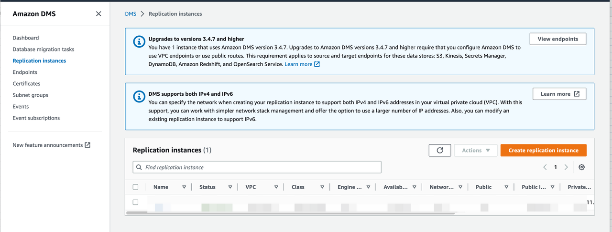

2. 创建终端节点。

   点击 **DMS** -> **Endpoints**，**创建终端节点**。

   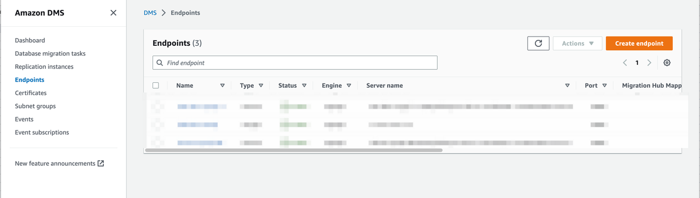

   分别创建 source endpoint 和 target endpoint。如果目标终端是 RDS 实例，请勾选**选择 RDS DB 实例**进行配置。

   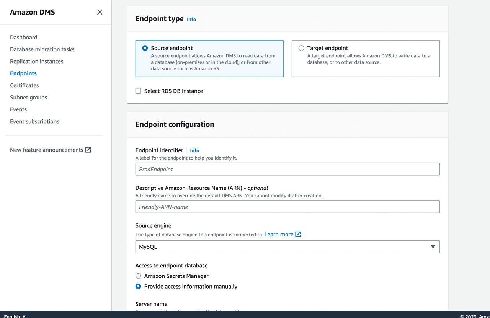

   配置完成后，可以使用指定的 Replication instance 测试下连通性：

   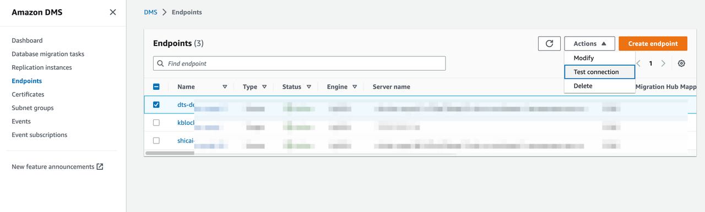

3. 创建迁移任务。

   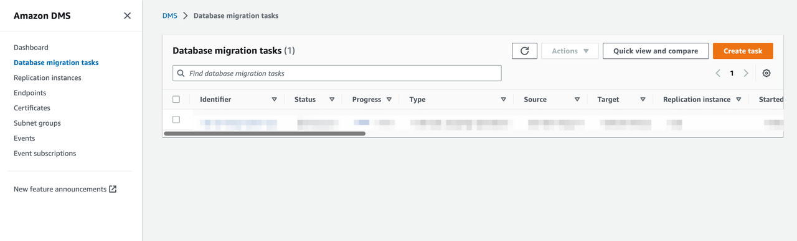

   点击**创建任务**，并根据指示配置任务。

   注意以下参数：

   * 迁移类型

     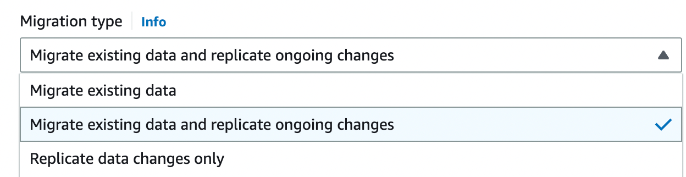

     AWS DMS 提供三种迁移类型：

     * Migrate existing data：只迁移存量数据，即任务运行后源实例发生的变更不会迁移到目标实例。
     * Migrate existing data and replicate ongoing changes：迁移存量+增量数据，即任务运行前的存量数据和任务运行中的增量数据都会被同步到目标实例。
     * Replicate data changes only：只迁移增量数据，可以配合后面的“CDC start mode for source transactions”配置指定位点迁移增量数据。

    在本文的迁移场景中，使用“**Migrate existing data and replicate ongoing changes**” 即可。

   * 目标表准备模式

     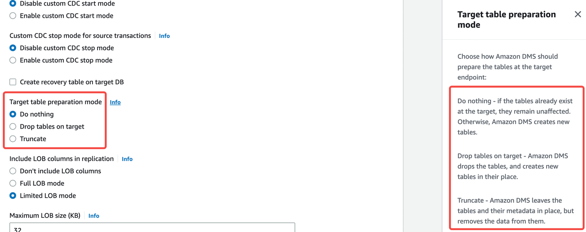

     目标表准备模式指定了数据结构的初始模式。你可以点击选项旁边的 Info 链接查看每种模式的定义。如果 ApeCloud MySQL 是一个新创建的空实例，你可以选择 **Do nothing** 模式。

     此外需注意，AWS DMS 不会自动创建数据库，迁移前，需在 ApeCloud MySQL 上创建一个数据库。

   * 启用验证功能
  
     建议启用此功能。

     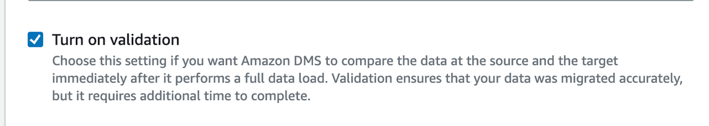

   * Batch 优化的应用模式
  
     建议启用此功能。该功能支持批量写目标实例，能显著提升写入速度

     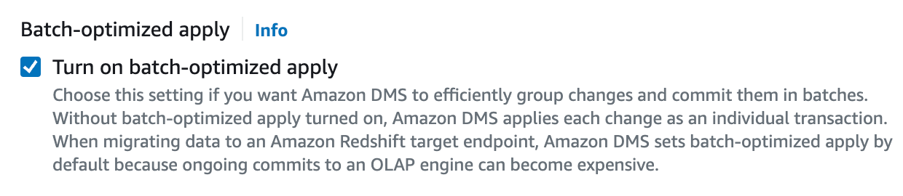

   * 全量加载调优设置：并行加载的最大表数

     该数值决定了 DMS 在获取源表数据时使用的并发数。理论上全量加载迁移可能给源表造成压力，当源表中的业务较为敏感时，可以降低这个数值。

     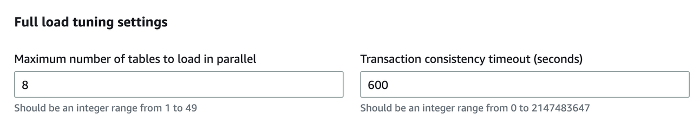

   * 表映射

     表映射决定了哪些表可以用于数据库迁移并应用简单的转换。建议启用 **Wizard** 模式来配置此参数。
4. 开始迁移任务。

## 应用切换

***开始之前***

* 确保 DMS 迁移任务正常运行。若已启动验证，请确保结果符合预期。
* 为了便于区分会话并提高数据安全性，建议创建并授权一个专门用于迁移的数据库帐户。
* 切换过程保险起见需要停止业务写入，同时，建议在业务低峰期做切换。

***步骤：***

1. 确保传输任务正常运行。

   重点关注表统计数据中的**任务状态**和**最后更新时间**，以及 CloudWatch 指标中的 **CDCLatencyTarget**。

   你还可以参考[此文档](https://repost.aws/zh-Hans/knowledge-center/dms-stuck-task-progress)来检查迁移任务。

   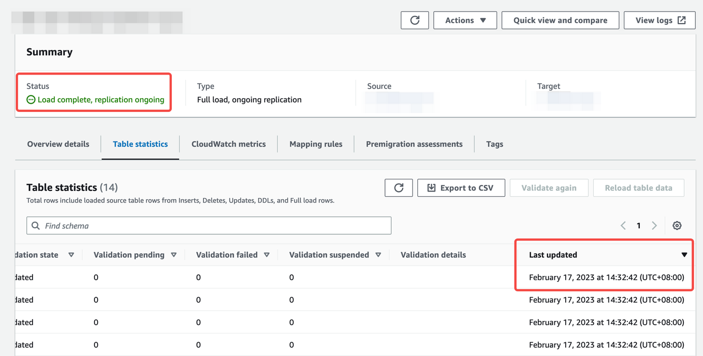

   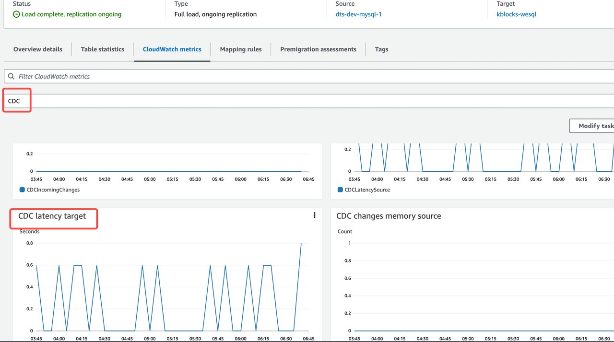

2. 暂停业务，禁止新的业务数据写入源库。
3. 再次查看传输任务的状态，确保任务正常运行且至少持续 1 分钟。

   参考步骤 1，观察链接是否正常，是否存在延迟。
4. 使用目标数据库恢复业务。
5. 验证迁移结果。
