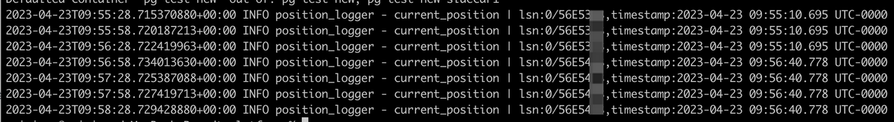

# Migrate data in MySQL to KubeBlocks

## Before you start

### Enable kbcli migration

1. Install KubeBlocks: You can install KubeBlocks by [kbcli](./../../installation/install-with-kbcli/install-kubeblocks-with-kbcli.md) or by [Helm](./../../installation/install-with-helm/install-kubeblocks-with-helm.md).
2. [Enable the migration add-on](./../../overview/supported-addons.md).

   ```bash
   kbcli addon list

   kbcli addon enable migration
   ```

### Configure the source

Modify the configuration of the source to support CDC.

1. Open 'log_bin' configuration.
2. Set 'binlog_format' configuration to 'row'.
3. Set 'binlog_row_image' configuration to 'full'.

:::note

1. Modifying 'log_bin' configuration restarts the database. Make sure the modification is performed during off-peak hours.
2. Modifying 'binlog_format' and 'binlog_row_image' configurations does not affect the existing binlog format. Make sure the log timestamp of pulling CDC (usually the time CDC starts) occurs after the modifications are completed.

:::

### Check the account permission

Make sure both the source and sink account meet the following permissions.

* The source account
  * REPLICATION SLAVE
  * REPLICATION CLIENT
  * SELECT
* The sink account
  * SELECT
  * INSERT
  * UPDATE
  * DELETE
  * CREATE
  * ALTER
  * DROP

### Initialize the sink

Create a database named `db_test`.

```bash
create database if not exists db_test
```

### Prepare data sampling

It is recommended to prepare data sampling for verification after the migration to ensure correctness.

## Migrate data

### Steps

1. Create a migration task.

   ```bash
   kbcli migration create mytask --template apecloud-mysql2mysql \
   --source user:123456@127.0.0.1:5432/db_test \
   --sink user:123456@127.0.0.2:5432/db_test \
   --migration-object '"public.table_test_1","public.table_test_2"'
   ```

   :paperclip: Table 1. Options explanation

   | Option     | Descriprion |
   | :--------- | :---------- |
   | mystask    | The name of the migration task. You can customize it. |
   | `--template` | It specifies the migration template. `--template apecloud-mysql2mysql` means that this migration task uses the template of migrating from MySQL to MySQL created by KubeBlocks. Run `kbcli migration templates` to view all available templates and the supported database information.   |
   | `--source`  | It specifies the source. `user:123456@127.0.0.1:5432/db_test` in the above example follows the format `${user_name}:${password}@${database connection url}/${database}`. For this guide, the connection URL uses the public network address. |
   | `--sink`     | It specifies the destination. `user:123456@127.0.0.2:5432/db_test` in the above example follows the format `${user_name}:${password}@${database connection url}/${database}`. For this guide, the connection URL uses the service address inside the Kubernetes cluster. |
   | `--migration-object`  | It specifies the migration object. The above example describes data in "public.table_test_1" and "public.table_test_2", including structure data, stock data, and incremental data generated during running migration task, will be migrated to the sink.    |

2. (Optional) Specify migration steps by the flag `--steps`.

   The default steps follow the order precheck -> structure initialization -> data initialization -> incremental migration. You can use `--steps` to specify migration steps. For example, perform tasks in the order of precheck -> data initialization -> incremental migration.

   ```bash
   kbcli migration create mytask --template apecloud-mysql2mysql \
   --source user:123456@127.0.0.1:5432/db_test \
   --sink user:123456@127.0.0.2:5432/db_test \
   --migration-object '"public.table_test_1","public.table_test_2"'
   --steps precheck=true,init-struct=false,init-data=true,cdc=true
   ```

3. View the task status.

   ```bash
   # View the migration task list
   kbcli migration list

   # View the details of a specified task
   kbcli migration describe ${migration-task-name}
   ```

   Pay attention to Initialization, CDC, and CDC Metrics.

   * Initialization
     * Precheck: If the status shows `Failed`, it means the initialization precheck does not pass. Troubleshoot the initialization by [the following examples in troubleshooting](#troubleshooting).
     * Init-struct: Structure initialization. Idempotent processing logic is adopted. A failure occurs only when a severe problem occurs, such as failing to connect a database.
     * Init-data: Data initialization. If there is a large amount of stock data, it takes a long time to perform this step and you should pay attention to Status.
   * CDC: Incremental migration. Based on the timestamp recorded by the system before the init-data step, the system starts data migration following eventual consistency and performs capturing the source library WAL (Write Ahead Log) changes -> writing to the sink. Under normal circumstances, the CDC phase continues if the migration link is not actively terminated.
   * CDC Metrics: Incremental migration indicators. Currently, the indicators mainly provide the WAL LSN (Log Sequencer Number) of the source library and the corresponding timestamp (note that the timestamp shows the local time zone of the Pod Container runtime) when the CDC process has completed "capturing -> writing" process.

     :::note

     The CDC Metrics are updated every 10 minutes by the system, i.e. if there exists continuous data writing into the source, metrics.timestamp here delays 10 minutes compared with the current time.

     :::

4. Validate the migration with the prepared data sampling.

### Troubleshooting

If any step above fails, run the command below to troubleshoot the failure.

```bash
# --step: Specify the step. Allowed values: precheck,init-struct,init-data,cdc
kbcli migration logs ${migration-task-name} --step ${step-name}
```

## Switch applications

### Before you start

* Make sure the KubeBlocks migration task runs normally.
* To differentiate the dialogue information and to improve data security, it is recommended to create and authorize another account dedicated to data migration.
* For safety concerns, it is necessary to stop the business write and switch the application during off-peak hours.
* Before switching the application, it is recommended to prepare data sampling for verification after switching to ensure correctness.

### Steps

1. Check the migration task status and ensure the task is performed normally.
   1. Describe the migration task details and all steps in Initialization are `Complete` and CDC is `Running`.

      ```bash
      kbcli migration describe ${migration-task-name}
      ```

   2. Under the prerequisite that there exists continuous write into the source, observe whether the timestamp is still in progress and whether there is almost no delay. For example,

      ```bash
      kbcli migration logs ${migration-task-name} --step cdc | grep current_position
      ```

      The results update every 10 seconds.

      
2. Pause the business and stop new business data from being written into the source.
3. View the migration status again and ensure the migration task runs normally, lasting at least one minute.

   Refer to the operations in step 1 and observe whether the link is normal and the timestamp meets the expectation.
4. Use the sink to restore the business.
5. Validate the switch with the prepared data sampling.

## Clean up the environment

After the migration task is completed, you can terminate the migration task and function.

### Terminate the migration task

Deleting the migration task does not affect the data in the source and sink.

```bash
kbcli migration terminate ${migration-task-name}
```

### Terminate kbcli migration

1. Check whether there are running migration tasks.

   ```bash
   kbcli migration list
   ```

2. Disable the migration add-on.

   ```bash
   kbcli addon disable migration
   ```

3. Delete the Kubernetes CRD (Custom Resource Definition) manually.

   ```bash
   kubectl delete crd migrationtasks.datamigration.apecloud.io migrationtemplates.datamigration.apecloud.io serialjobs.common.apecloud.io
   ```
