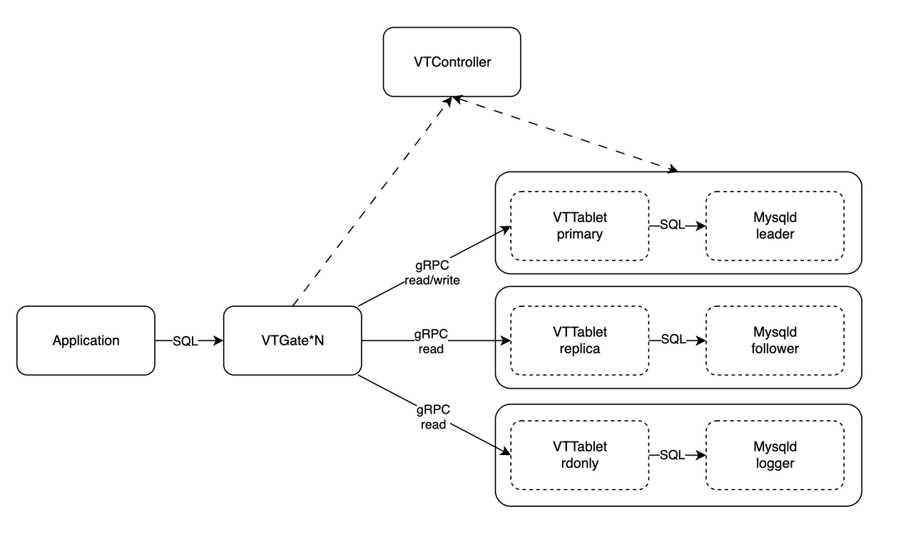

# MySQL 代理

## 简介

数据库代理是数据库开发和管理人员改善应用程序的可伸缩性、性能、安全性和弹性的重要工具。

ApeCloud MySQL 代理是一个专为与 MySQL 高度兼容而设计的数据库代理。它支持 MySQL 传输协议、读写分离、连接池和透明的故障切换。本节介绍 ApeCloud MySQL 代理的架构、功能和主要优势。

## 架构

ApeCloud MySQL 代理是 Vitess 项目的一个分支。为了提供更好的 SQL 兼容性，例如更好的子查询、公共表表达式（CTE）和表达式评估，它移除了对分片的支持。下图展示了代理集群的架构。

**VTGate**：客户端应用一般通过标准的 MySQL 传输协议连接到 VTGate。VTGate 是无状态的，可以轻松高效地扩展其大小和性能。它类似于 MySQL，负责解析 SQL 查询，还有规划和路由查询请求到 VTTablet 上进行处理。

**VTTablet**：VTTablet 通常作为 MySQL 的附加组件实现。如果 ApeCloud MySQL 代理部署在 Kubernetes 中，那么 VTTablet 与 MySQL 就放置在同一个 pod 中。VTTablet 接受来自 VTGate 的 gRPC 请求，然后将这些查询发送到 MySQL 上执行。VTTablet 还处理一些权限检查和日志记录的任务，但其最关键的角色是确保适当的连接池管理。

**VTController**：VTController 组件帮助在 VTGate 和 VTTablet 之间实现服务发现，并使它们能够存储集群的元数据。如果 MySQL 的角色发生变化，例如从 Leader 变为 Follower，VTTablet 的角色也会相应变化。VTController 会检查 MySQL 集群的状态，并向 VTTablet 发送命令，请求其更改角色。

## 连接池

数据库连接会占用内存。为了确保缓冲池中有足够的内存，数据库通常会限制 'max_connections' 的值。然而，由于应用程序通常是无状态的，并且可能需要快速扩展和创建大量连接，数据库很有可能会超负荷运行。因此，这类应用程序不适合直接连接到 MySQL 服务器并创建连接池。

使用 ApeCloud MySQL 代理，应用程序可以根据需要创建任意数量的连接，无需担心 'max_connections' 错误。因为 ApeCloud MySQL 代理接管了数据库连接池的建立，允许应用程序在 MySQL 服务器端共享和重用连接。这降低了 MySQL 服务器端打开和关闭连接所带来的内存和 CPU 开销，提高了可伸缩性和性能。

## 读写分离

使用只读节点可以显著减轻主数据库节点的工作负载，提高资源利用率。然而，管理多个只读节点并决定何时使用各个节点却并不容易。ApeCloud MySQL 代理通过提供三个重要功能来解决这个问题：读写分离、写后读一致性和负载均衡。这些功能可以使应用程序更有效地利用只读节点。

**读写分离t**：ApeCloud MySQL 代理通过自动将读查询路由到只读节点，将写查询路由到主节点，简化了应用程序逻辑。这是通过解析 SQL 语句实现的，它因此改善了负载均衡，确保有效利用可用资源。

**写后读一致性**: ：此功能与读写分离配合使用，以在获得性能改进的同时保持数据一致性。当应用程序将数据写入主节点，并在只读节点上读取时，ApeCloud MySQL 代理确保刚刚写入主节点的数据可以从只读节点中访问和读取。

**负载均衡**：ApeCloud MySQL 代理通过使用各种负载均衡策略将查询路由到适当的只读节点，从而帮助管理只读节点。这确保工作负载在所有可用节点上均匀分布，因此实现了性能优化和资源利用率的提高。

## 透明的故障切换

故障切换旨在确保当系统中原始数据库实例不可用时，能切换到另一个实例上并保持其高可用性。触发故障切换的因素有很多，包括数据库实例问题和计划维护过程（如数据库升级）等。

在没有 ApeCloud MySQL 代理的情况下，故障切换需要短暂的停机时间与数据库的现有连接断开，还需要应用程序重新打开这些连接。ApeCloud MySQL 代理能够自动检测故障切换，并在保持应用程序连接完整的同时，将应用程序的 SQL 缓冲在其内存中，在数据库出现问题的情况下增强应用程序的弹性。

应用程序端的连接错误问题通常无法完全解决。然而，代理是无状态的，开发者可以部署多个节点以实现高可用性。此外，代理的重启/恢复速度也比数据库更快，因为它不需要从撤销-重做日志中恢复。
