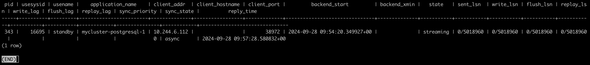
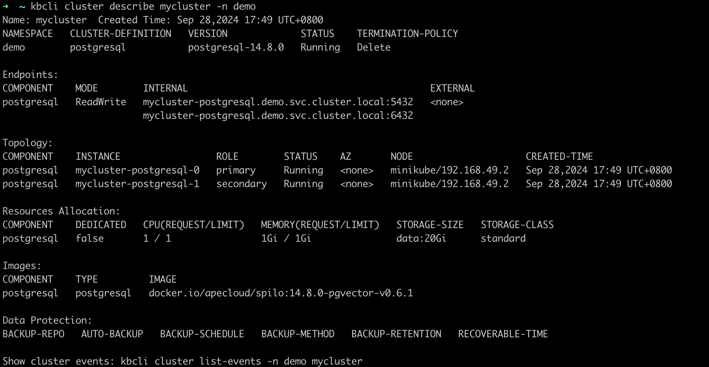

# 高可用

KubeBlocks 集成[开源的 Patroni 方案](https://patroni.readthedocs.io/en/latest/)以实现高可用性，主要采用 Noop 切换策略。

## 开始之前

* 安装 [kbcli](./../../installation/install-with-kbcli/install-kbcli.md)。
* 安装 KubeBlocks：你可以用 [kbcli](./../../installation/install-with-kbcli/install-kubeblocks-with-kbcli.md) 或 [Helm](./../../installation/install-with-helm/install-kubeblocks-with-helm.md) 进行安装。
* [创建 PostgreSQL 主备版](./../cluster-management/create-and-connect-a-postgresql-cluster.md#创建-postgresql-集群)。
* 检查切换策略和角色探测参数。
  * 检查切换策略是否为 `Noop`。

    ```bash
    kubectl get cluster pg-cluster -o yaml
    >
    spec:
      componentSpecs:
      - name: postgresql
        componentDefRef: postgresql
        switchPolicy:
          type: Noop
    ```

  * 检查角色探测参数，验证角色探测是否已启用。

    ```bash
    kubectl get cd postgresql -o yaml
    >
    probes:
      roleProbe:
        failureThreshold: 3
        periodSeconds: 2
        timeoutSeconds: 1
    ```

## 步骤

1. 查看 PostgreSQL 集群的初始状态。

   ```bash
   kbcli cluster describe pg-cluster
   ```

   

   当前 `pg-cluster-postgresql-0` 是主节点，`pg-cluster-postgresql-1` 是从节点。

2. 模拟主节点异常。

   ```bash
   # 进入主节点
   kubectl exec -it pg-cluster-postgresql-0  -- bash

   # 删除 PostgreSQL 的数据目录，模拟异常
   root@postgres-postgresql-0:/home/postgres# rm -fr /home/postgres/pgdata/pgroot/data
   ```

3. 查看日志，检查发生异常情况时节点角色的切换情况。

   ```bash
   # 查看主节点日志
   kubectl logs pg-cluster-postgresql-0
   ```

   在日志中可以看到，主节点释放了 Leader 锁并进行了高可用切换。

   ```bash
   2023-04-18 08:06:52,338 INFO: Lock owner: pg-cluster-postgresql-0; I am pg-cluster-postgresql-0
   2023-04-18 08:06:52,460 INFO: Leader key released
   2023-04-18 08:06:52,552 INFO: released leader key voluntarily as data dir empty and currently leader
   2023-04-18 08:06:52,553 INFO: Lock owner: pg-cluster-postgresql-1; I am pg-cluster-postgresql-0
   2023-04-18 08:06:52,553 INFO: trying to bootstrap from leader 'pg-cluster-postgresql-1'
   ```

   ```bash
   # 查看从节点日志
   kubectl logs pg-cluster-postgresql-1
   ```

   原来的从节点获取了锁并成为了新的主节点。

   ```bash
   2023-04-18 08:07:14,441 INFO: no action. I am (pg-cluster-postgresql-1), the leader with the lock
   2023-04-18 08:07:24,354 INFO: no action. I am (pg-cluster-postgresql-1), the leader with the lock
   ```

4. 连接到 PostgreSQL 集群，查看集群信息。

   ```bash
   kbcli cluster connect pg-cluster
   ```

   ```bash
   postgres=# select * from pg_stat_replication;
   ```

   

   从输出可以看到，`pg-cluster-postgresql-0` 被指定为从节点。

5. 查看集群，检查实例角色。

   ```bash
   kbcli cluster describe pg-cluster
   ```

   

   故障切换后，`pg-cluster-postgresql-0` 变成了从节点，`pg-cluster-postgresql-1` 变成了主节点。
