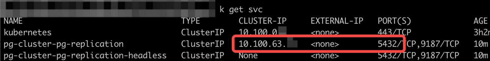
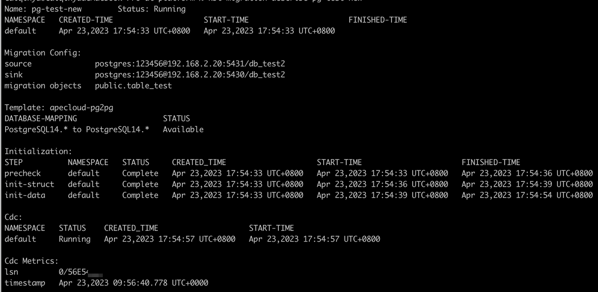

# 使用 KubeBlocks 迁移 PostgreSQL 数据

## 环境及目标

* 源端：阿里云 ECS 上用 Pigsty 安装的 PostgreSQL 14，内置了 PostGIS 插件，并使用 osm2pgsql 导入了开源地图数据。

* 目标端：AWS EKS 上使用 KubeBlocks 安装的 PostgreSQL 14.7.0，未安装任何插件。

* 目标：将源数据库中的 db_test.public.table_test_1 和 db_test.public.table_test2 迁移到目标数据库。

## 开始之前

### 启用 kbcli migration 功能

1. 安装 KubeBlocks：用 [kbcli](./../../installation/install-with-kbcli/install-kubeblocks-with-kbcli.md) 或 [Helm](./../../installation/install-with-helm/install-kubeblocks-with-helm.md) 进行安装。
2. [开启迁移引擎](./../../overview/database-engines-supported.md)。

   ```bash
   kbcli addon list

   kbcli addon enable migration
   ```

### 配置源端

修改源端的配置以支持 CDC。

1. 将 'wal_level' 配置设置为 'logical'。
2. 确保 'max_replication_slots' 数量足够。
3. 确保 'max_wal_senders' 数量足够。

:::note

* 如果使用 Pigsty 安装了 PostgreSQL，可以通过执行 `pg edit-config` 命令来修改配置。
* 修改 WAL 配置将重启数据库。请确保在非高峰时段进行修改。

:::

### 检查账号权限

确保源端账号和目标端账号满足以下权限要求。

* 源端账号
  * LOGIN 权限
  * 源端迁移对象的读权限
  * REPLICATION 权限
* 目标端账号
  * LOGIN 权限
  * 目标端读写权限

### 初始化目标数据库

1. 创建一个名为 `db_test` 的数据库。

   ```bash
   create database db_test;
   ```

2. 安装 PostGIS 并导入 osm 数据。

   * [安装 PostGIS](https://postgis.net/install/). 如果你使用 Pigsty 安装了 PostgreSQL，PostGIS 已内置在其中，可根据需要执行 `CREATE EXTENSION` 命令。
   * [导入 osm 数据](https://github.com/openstreetmap/osm2pgsql)。
  
  :::note

  在 KubeBlocks v0.5.0 版本的迁移功能中，结构初始化有以下限制：

   1. 不支持用户定义类型。
   2. 不支持迁移数组数据类型（例如text[]、text[3][3]和integer[]）。

  :::

### 准备数据采样

为了确保正确性，建议在迁移后准备数据采样进行验证。

## 迁移数据

### 步骤

1. 创建迁移任务。

   ```bash
   kbcli migration create mytask --template apecloud-pg2pg \
   --source user:123456@127.0.0.1:5432/db_test \
   --sink user:123456@127.0.0.2:5432/db_test \
   --migration-object '"public.table_test_1","public.table_test_2"'
   ```

   :paperclip: 表 1. 选项详情

   | 选项     | 解释 |
   | :--------- | :---------- |
   | mystask    | 迁移任务的名称，可以自定义。 |
   | `--template` | 指定迁移模板。`--template apecloud-pg2pg` 表示此迁移任务使用由 KubeBlocks 创建的从 PostgreSQL 到 PostgreSQL 的模板。执行 `kbcli migration templates` 可查看所有可用的模板和支持的数据库信息。  |
   | `--source`  | 指定源端。上例中的 `user:123456@127.0.0.1:5432/db_test` 遵循 `${user_name}:${password}@${database connection url}/${database}` 的格式。在本文档中，连接 URL 使用的是公网地址。 |
   | `--sink`     | 指定目标端。上例中的 `user:123456@127.0.0.2:5432/db_test` 遵循 `${user_name}:${password}@${database connection url}/${database}` 的格式。在本文档中，连接 URL 使用的是 Kubernetes 集群内部的服务地址。 |
   | `--migration-object`  | 指定迁移对象。也就是上例中 "public.table_test_1" 和 "public.table_test_2" 中的数据，包括结构数据和库存数据，在迁移期间生成的增量数据将被迁移到目标位置。   |

   :::note

   `--sink` URL 的示例如下:

   

   :::

2. （可选）通过 `--steps` 指定迁移步骤。

   默认按照预检查 -> 结构初始化 -> 数据初始化 -> 增量迁移的顺序进行迁移。你可以使用 --steps 参数来指定迁移步骤。例如，按照预检查 -> 全量初始化 -> 增量迁移的顺序执行任务。

   ```bash
   kbcli migration create mytask --template apecloud-pg2pg \
   --source user:123456@127.0.0.1:5432/db_test \
   --sink user:123456@127.0.0.2:5432/db_test \
   --migration-object '"public.table_test_1","public.table_test_2"'
   --steps precheck=true,init-struct=false,init-data=true,cdc=true
   ```

3. 查看任务状态。

   ```bash
   # 查看迁移任务列表
   kbcli migration list

   # 查看指定任务的详细信息
   kbcli migration describe ${migration-task-name}
   ```

   

   有关初始化、CDC 和 CDC Metrics 有几点需要说明。

   * 初始化
     * Precheck：预检查。如果状态显示为 `Failed`，表示初始化预检查未通过。请参考[故障排除](#故障排除)中的示例解决问题。
     * Init-struct：结构初始化。采用幂等处理逻辑，只有在发生严重问题（例如无法连接数据库）时才会失败。
     * Init-data：数据初始化。如果存在大量库存数据，该步骤需要花费较长时间，请注意查看 `Status`。
   * CDC：增量迁移。基于 init-data 步骤之前系统记录的时间戳，系统将按照最终一致性的原则开始数据迁移，并执行源库的 WAL（预写式日志）变更捕获 -> 写入到目标库。正常情况下，如果迁移链路没有被主动终止，CDC 会持续进行。
   * CDC Metrics：增量迁移指标。目前主要提供源库的 WAL LSN（日志序列号）和 CDC 完成“捕获 -> 写入”过程的相应时间戳（请注意时间戳显示的是 Pod 容器运行时的本地时区）。

     :::note

     系统每 10 分钟更新一次 CDC Metrics。即，如果源库存在连续的数据写入，metrics.timestamp 会相对于当前时间延迟 10 分钟。

     :::

4. 使用准备好的数据采样对迁移进行验证。

### 故障排除

如果上述任何步骤失败，可执行以下命令排查失败原因。

```bash
# --step: 指定步骤。有效值: precheck,init-struct,init-data,cdc
kbcli migration logs ${migration-task-name} --step ${step-name}
```

## 切换应用程序

### 开始之前

* 确保 KubeBlocks 迁移任务正常运行。
* 为了区分对话信息并提高数据安全性，建议创建和授权另一个专用于数据迁移的账号。
* 出于安全考虑，需要在非高峰时段停止业务写入并切换应用程序。
* 在切换应用程序之前，建议进行数据采样以便在切换后进行验证，确保正确性。
* 注意 serial、sequence 和 slot 的使用。
* 请注意 serial 和 sequence：

   在切换应用程序之前，查询并记录 Sequence 的最大值，并将其设置为目标数据库 Sequence 的初始值。

   在业务切换到目标数据库之后，默认新写入的 Sequence 不会以源库的 Sequence 的最大值作为初始值继续去递增。需要手动设置。

    ```bash
    # PostgreSQL Function 示例:

    CREATE FUNCTION build_setvals() returns void
    AS $$
    declare
      nsp name;
      rel name;
      val int8;
    begin
      for nsp,rel in select nspname,relname from pg_class t2 , pg_namespace t3 where t2.relnamespace=t3.oid and t2.relkind='S'
      loop
        execute format($_$select last_value from %I.%I$_$, nsp, rel) into val;
        raise notice '%',
        format($_$select setval('%I.%I'::regclass, %s);$_$, nsp, rel, val+1);
      end loop;
    end;
    $$ 
    LANGUAGE plpgsql;

    # Execute:
    psql -hxx -p xx -U xx -d xx -c "set client_min_messages = notice; select build_setvals();" | grep setval

    # Output like:
    NOTICE:  select setval('public.seq_test_1'::regclass, 2);
    NOTICE:  select setval('public.seq_test_2'::regclass, 1001);
    NOTICE:  select setval('public.seq_test_3'::regclass, 203);
    NOTICE:  select setval('public.seq_test_4'::regclass, 476);

    # Execute the above script in the sink
    ```

* Slot 的生命周期

  CDC 阶段（增量迁移）依赖于 slot。在 CDC 阶段会创建 replication slot 和 publication，在删除迁移任务元数据之前，应首先删除这些元数据。

  如果执行了增量迁移，迁移任务会在 init-data 步骤的初始化阶段创建一个以任务名称命名的 replication slot （任务名称中的连字符“-”会被替换为下划线“_”）。当增量迁移开始时，迁移任务会创建以  replication slot  名+“_publication_for_all_tables” 命名的 publication，用于进行 WAL 日志消费。

  当删除迁移任务（执行 `kbcli migration terminate` 命令）时，该任务会变为 Terminating 状态，会先停止 CDC 进程，然后尝试清除上述 replication slot 和 publication。只有在上述元数据清除后，才会删除迁移任务的元数据。

  :::note

  如果不清理 slot，会影响 PostgreSQL 中的日志清理逻辑。当 PostgreSQL 磁盘空间不足且冗余 slot 阻止日志清理时，可能会发生严重故障。

  因此，只有在完成 slot 清理后，才能删除迁移任务。如果有一个 PostgreSQL 任务长时间保持 Terminating 状态，请注意 slot 和磁盘水位的情况，并在必要时手动进行干预。
  
  清理操作采用幂等逻辑，常见的清理失败原因包括：

  * 运行时，源库的连接串发生变化，MigrationTask 无法连接源库。
  * 运行时，源库的帐户和密码发生变化，MigrationTask 无法连接源库。
  * 运行时，源库帐户的权限发生变化，MigrationTask 无法进行删除。

  :::

### 步骤

1. 检查迁移任务状态，确保任务正常进行。
   1. 查看详细信息，确保初始化的所有步骤均为 `Complete`，且 CDC 处于 `Running` 状态。

      ```bash
      kbcli migration describe ${migration-task-name}
      ```

   2. 在源库连续写入的前提下，观察时间戳是否仍在进行中，以及是否有延迟。例如：

      ```bash
      kbcli migration logs ${migration-task-name} --step cdc | grep current_position
      ```

      其结果每 10 秒更新一次。

      
2. 暂停业务，禁止新的业务数据写入源库。
3. 再次查看迁移状态，确保任务正常运行且至少持续一分钟。

   参考步骤 1，观察链接是否正常，时间戳是否符合预期。
4. 使用目标数据库恢复业务。
5. 使用准备好的数据采样验证切换是否正确。

## 清理环境

在迁移任务完成后，可以终止迁移任务和相关功能。

### 终止迁移任务

终止迁移任务不会影响源数据库和目标数据库中的数据。

```bash
kbcli migration terminate ${migration-task-name}
```

### 停用 kbcli migration

1. 检查是否有正在执行的迁移任务。

   ```bash
   kbcli migration list
   ```

2. 禁用迁移引擎。

   ```bash
   kbcli addon disable migration
   ```

3. 手动删除 Kubernetes CRD（自定义资源定义）。

   ```bash
   kubectl delete crd migrationtasks.datamigration.apecloud.io migrationtemplates.datamigration.apecloud.io serialjobs.common.apecloud.io
   ```
