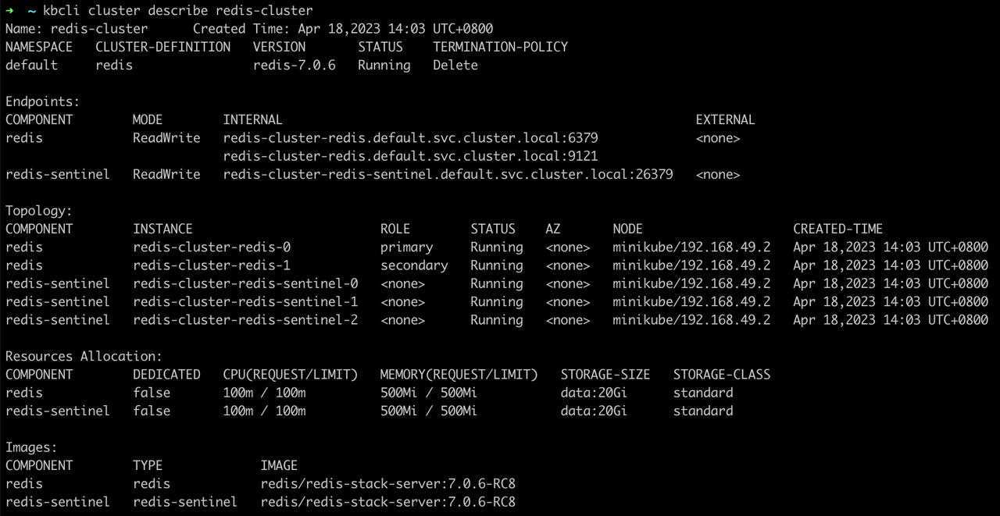
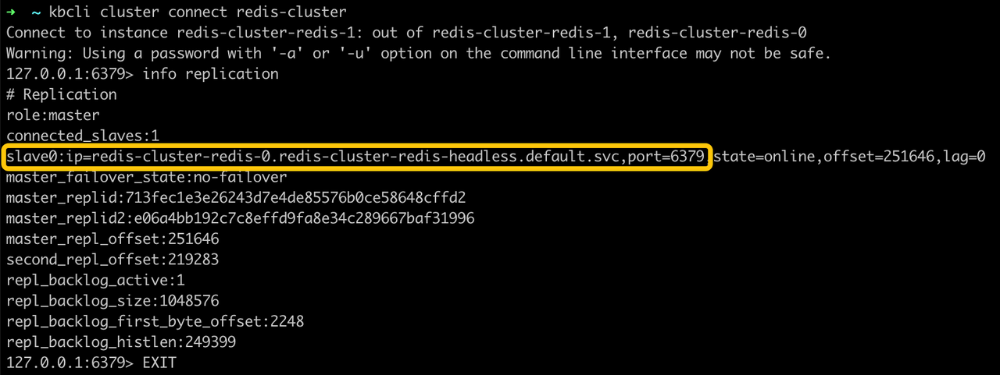
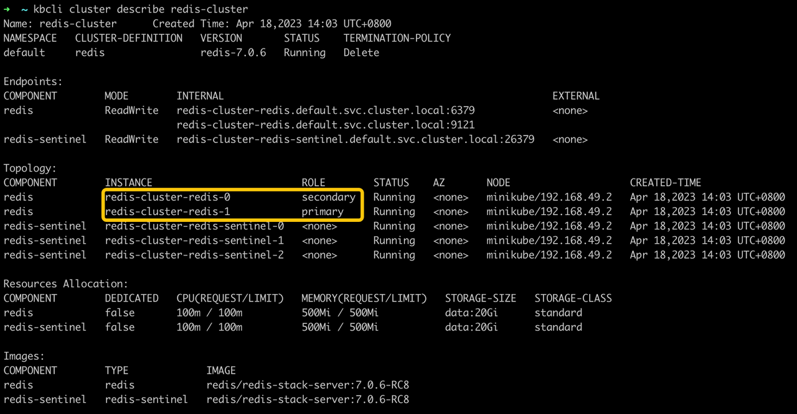

import Tabs from '@theme/Tabs';
import TabItem from '@theme/TabItem';

# 高可用

KubeBlocks 集成 [Redis Sentinel 官方解决方案](https://redis.io/docs/management/sentinel/)以实现高可用性，并采用 Noop 作为切换策略。

Redis Sentinel 是 Redis 官方推荐的主备集群高可用性解决方案，在社区中备受欢迎。

在 KubeBlocks 提供的 Redis 主备集群中，Sentinel 是一个独立的组件。

## 开始之前

* 安装 KubeBlocks，可通过 [kbcli](./../../installation/install-with-kbcli/install-kubeblocks-with-kbcli.md) 或 [Helm](./../../installation/install-with-helm/install-kubeblocks.md) 安装。
* [创建 Redis 主备版集群](./../../kubeblocks-for-redis/cluster-management/create-and-connect-to-a-redis-cluster.md#创建集群)。
* 检查切换策略和角色探测参数。
  * 检查切换策略是否为 `Noop`。

    ```bash
    kubectl get cluster redis-cluster -o yaml
    >
    spec:
      componentSpecs:
      - name: redis
        componentDefRef: redis
        switchPolicy:
          type: Noop
    ```

  * 检查角色探测参数，验证角色探测是否已启用。

    ```bash
    kubectl get cd redis -o yaml
    >
    probes:
      roleProbe:
        failureThreshold: 2
        periodSeconds: 2
        timeoutSeconds:1
    ```

## 步骤

<Tabs>

<TabItem value="kubectl" label="kubectl" default>

1. 查看 Redis 集群的初始状态。

    ```bash
    kubectl get pods -l kubeblocks.io/role=primary -n demo
    >
    NAME                READY   STATUS    RESTARTS   AGE
    mycluster-redis-0   3/3     Running   0          24m

    kubectl get pods -l kubeblocks.io/role=secondary -n demo
    >
    NAME                READY   STATUS    RESTARTS      AGE
    mycluster-redis-1   3/3     Running   1 (24m ago)   24m
    ```

   当前 `mycluster-redis-0` 是主节点，`mycluster-redis-1` 是从节点。

   :::note

   如需更完整的输出，您可使用 `-o` 参数。

   ```bash
   kubectl get pods  -o custom-columns=NAME:.metadata.name,ROLE_LABEL:.metadata.labels."kubeblocks\.io/role"
   ```

   :::

2. 模拟主节点异常。

   ```bash
   # 进入主节点
   kubectl exec -ti -n demo mycluster-redis-0 -- bash

   # 执行 debug sleep 命令，模拟主节点异常
   root@mycluster-redis-0:/# redis-cli debug sleep 30
   ```

3. 打开 Redis Sentinel 日志，查看故障切换情况。

   ```bash
   kubectl logs mycluster-redis-sentinel-0 -n demo
   ```

   在日志中可以看到高可用切换发生的时间。

   ```bash
   1:X 18 Apr 2023 06:13:17.072 # +switch-master mycluster-redis-sentinel mycluster-redis-0.mycluster-redis-headless.default.svc 6379 mycluster-redis-1.mycluster-redis-headless.default.svc 6379
   1:X 18 Apr 2023 06:13:17.074 * +slave slave mycluster-redis-0.mycluster-redis-headless.default.svc:6379 mycluster-redis-0.mycluster-redis-headless.default.svc 6379 @ mycluster-redis-sentinel mycluster-redis-1.mycluster-redis-headless.default.svc 6379
   1:X 18 Apr 2023 06:13:17.077 * Sentinel new configuration saved on disk
   ```

4. 连接到 Redis 集群，查看异常发生后的主节点信息。

    ```bash
    127.0.0.1:6379> info replication
    ```

   从输出可以看到，`mycluster-redis-1` 是主节点。

5. 查看集群，检查实例角色。

   ```bash
   kubectl get pods -l kubeblocks.io/role=primary -n demo
   kubectl get pods -l kubeblocks.io/role=secondary -n demo
   ```

   故障切换后，`mycluster-redis-0` 变成了从节点，`mycluster-redis-1` 变成了主节点。

</TabItem>

<TabItem value="kbcli" label="kbcli">

1. 查看 Redis 集群的初始状态。

   ```bash
   kbcli cluster describe redis-cluster
   ```

   

   当前 `redis-cluster-redis-0` 是主节点，`redis-cluster-redis-1` 是从节点。

2. 模拟主节点异常。

   ```bash
   # 进入主节点
   kubectl exec -it redis-cluster-redis-0  -- bash

   # 执行 debug sleep 命令，模拟主节点异常
   root@redis-redis-0:/# redis-cli debug sleep 30
   ```

3. 打开 Redis Sentinel 日志，查看故障切换情况。

   ```bash
   kubectl logs redis-cluster-redis-sentinel-0
   ```

   在日志中可以看到高可用性切换发生的时间。

   ```bash
   1:X 18 Apr 2023 06:13:17.072 # +switch-master redis-cluster-redis-sentinel redis-cluster-redis-0.redis-cluster-redis-headless.default.svc 6379 redis-cluster-redis-1.redis-cluster-redis-headless.default.svc 6379
   1:X 18 Apr 2023 06:13:17.074 * +slave slave redis-cluster-redis-0.redis-cluster-redis-headless.default.svc:6379 redis-cluster-redis-0.redis-cluster-redis-headless.default.svc 6379 @ redis-cluster-redis-sentinel redis-cluster-redis-1.redis-cluster-redis-headless.default.svc 6379
   1:X 18 Apr 2023 06:13:17.077 * Sentinel new configuration saved on disk
   ```

4. 连接到 Redis 集群，查看异常发生后的主节点信息。

   ```bash
   kbcli cluster connect redis-cluster
   ```

   ```bash
   # 查看当前的主节点
   127.0.0.1:6379> info replication
   ```

   

   从输出可以看到，`redis-cluster-redis-1` 是主节点。

5. 查看集群，检查实例角色。

   ```bash
   kbcli cluster describe redis-cluster
   ```

   

   故障切换后，`redis-cluster-redis-0` 变成了从节点，`redis-cluster-redis-1` 变成了主节点。

</TabItem>

</Tabs>
