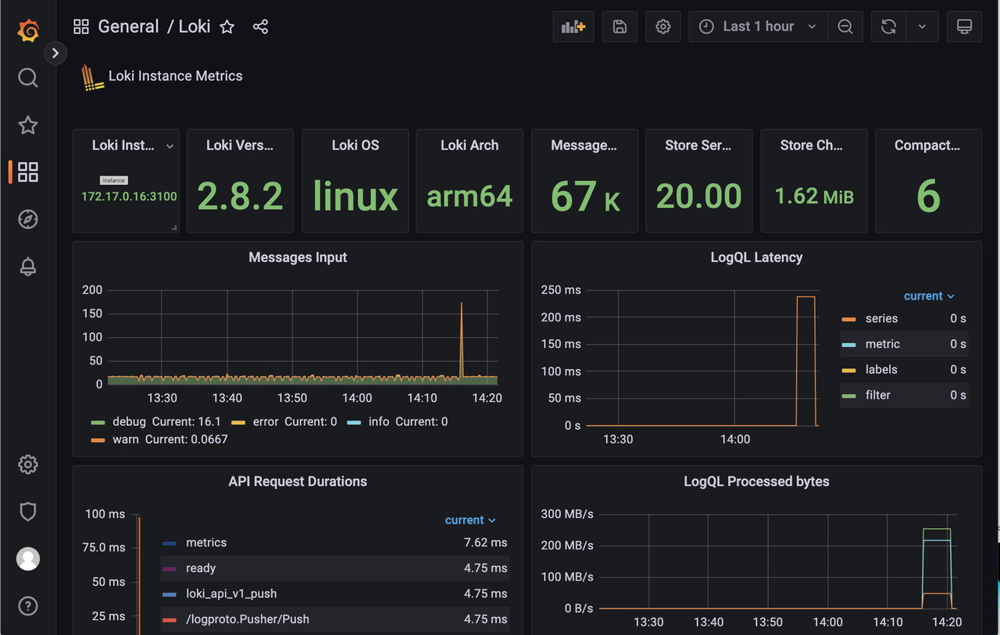
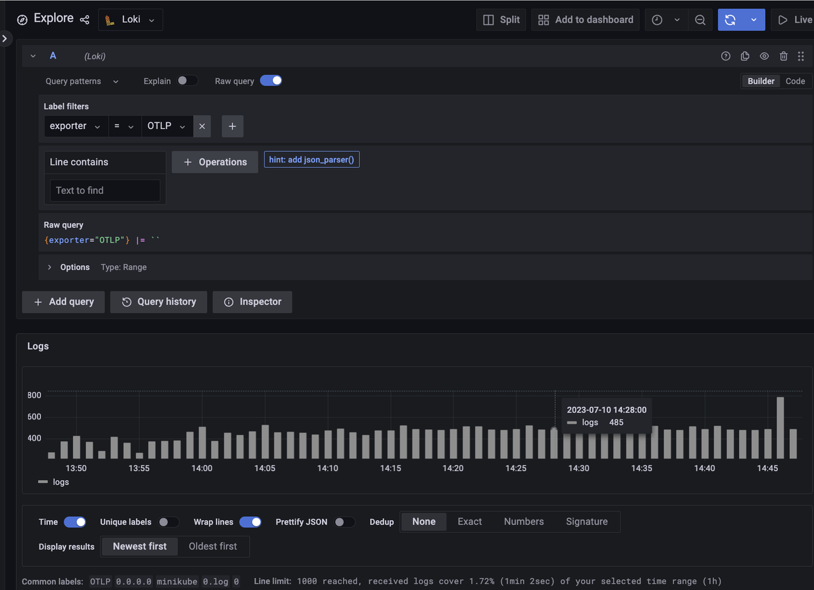

# 高级日志

目前，KubeBlocks 支持通过 `kbcli cluster logs` 查看集群的运行日志、错误日志和慢日志。这种方法具有轻量级的优点，只需依赖于目标容器中的日志文件和 `tail` 命令即可，无需在集群或客户端中安装任何软件或插件。这种方法也被称为 `cluster logs` 功能。

然而，它也有明显的缺点。它强依赖容器的存活和当前日志文件状态。如果容器已经处于异常或日志文件被删除，该方法就无法按预期实现。

而 `advanced logs` 功能可以更好地保留问题现场的日志线索，支持日志数据的长期远端备份，并便于与外部系统集成。

该功能支持将日志数据存储到集群中的 Loki 服务器和远程的 AWS S3 服务中。存储在 Loki 中的数据可以通过 `logcli` 客户端和 Grafana 控制台访问和显示。存储在 S3 中的数据支持导入和与其他系统的集成，以便进行进一步处理和分析。

## 引擎介绍

KubeBlocks 以引擎的形式统一管理 Agamotto、Loki、Prometheus 等与可观测性相关的组件。每个引擎都有其特色。

- Agamotto 负责收集性能、日志等数据，属于采集引擎。
- Loki 负责存储日志类数据，属于存储引擎。
- Grafana 负责页面展示可观测数据，属于前端展示引擎。
- Logcli 通过 kbcli plugin 形式安装，提供原生的 LogQL 查询能力，属于前端查询引擎。

## 开始之前

- [安装 kubectl](https://kubernetes.io/docs/tasks/tools/)。
- 用 [kbcli](../installation/install-with-kbcli/install-kubeblocks-with-kbcli.md) 或 [Helm](../installation/install-with-helm/install-kubeblocks-with-helm.md) 安装 KubeBlocks。

## 启用高级日志功能

### 启用 Loki

Loki 引擎用于存储日志数据，并接受来自前端的搜索请求。详情请参考 [Loki 官方文档](https://grafana.com/docs/loki/latest/)。

:::caution

在启用高级日志功能之前，需要先部署 Loki 节点，然后再应用 Agamotto，避免日志数据丢失。

:::

1. 查看 Loki 引擎的状态，检查其是否已启用。

    ```bash
    kbcli addon list | grep loki
    ```

2. 如果未启用，请执行以下命令以启用引擎。

    此命令以 `statefulset` 模式运行 Loki。KubeBlocks 将默认部署 single binary 类型的单节点 Loki，即配置中的 `target` 是 `all`，使用一个 10 GB 的 PV 来存储数据，并启动一个 `loki-gateway` 服务来接收数据。

    ```bash
    kbcli addon enable loki
    >
    NAME                           TYPE   PROVIDER    STATUS     AUTO-INSTALL   AUTO-INSTALLABLE-SELECTOR   
    loki                           Helm   apecloud    Enabled    false   
    ```

    检查该 Pod 是否正在运行。

    ```bash
    kubectl get pods | grep loki
    >
    NAME                                            READY   STATUS    RESTARTS   AGE
    kb-addon-loki-0                                 1/1     Running   0          47h
    loki-gateway-5f4895c7b-5khv7                    1/1     Running   0          47h
    ```

3. 运行 Grafana ，查看 Loki 的状态。
   

4. （可选）禁用 Loki 引擎。

    ```bash
    kbcli disabled loki
    ```

默认情况下，Loki 保存近 3 天的日志数据，超过 72 小时的数据将被自动删除。你可以使用以下命令来调整存储策略。在调整策略时，请注意主机的磁盘资源和 Loki PVC。目前，Loki 不支持 size-based retention。

```bash
# 新的 retention_period 必须是 24 的整数倍
kbcli addon enable loki --set loki.loki.limits_config.retention_period=168h
```

运行 `kubectl get pv` 查看当前 Loki 实例的 PV 信息。

```bash
kubectl get pv
>
NAME                                       CAPACITY   ACCESS MODES   RECLAIM POLICY   STATUS   CLAIM                               STORAGECLASS      REASON   AGE
pvc-ed20ec94-9a58-46e4-9c28-b692cba70e79   8Gi        RWO            Delete           Bound    kb-system/storage-kb-addon-loki-0   csi-hostpath-sc            28h
```

如果想检查当前 Loki 节点的磁盘使用情况，可以使用 `exec` 命令登录容器，并使用 `du` 命令检查磁盘使用情况。例如：
1. 登录 Loki 容器。

    ```bash
    kubectl exec -it kb-addon-loki-0 -n kb-system -- /bin/sh
    ```

2. 执行 `du` 命令。

    ```bash
    du -sh /var/loki/*
    >
    152.0K  /var/loki/boltdb-shipper-active
    228.0K  /var/loki/boltdb-shipper-cache
    7.4M    /var/loki/chunks
    4.0K    /var/loki/compactor
    64.0K   /var/loki/retention
    4.0K    /var/loki/rules
    3.5M    /var/loki/wal
    ```

### 启用 Agamotto
启用日志收集功能后，Agamotto 会检测两个本地文件夹，即 `/var/log/pods` 和 `/var/log/kubeblocks`。所有符合以下模式的文件都将被采集：

- `/var/log/pods` 目录：用于存储存储容器的标准输出和错误日志。文件模式为 `/var/log/pods/**/**/*.log`。
- `/var/log/kubeblocks` 目录：可以自定义日志文件的存储位置。默认情况下，KubeBlocks 存储数据库引擎的日志，如错误日志和慢日志。文件模式为 `/var/log/kubeblocks/**/**/*.log`。

1. 查看 `Agamotto add-on` 的状态，检查其是否已启用。

    ```bash
    kbcli addon list | grep agamotto
    ```

2. 如果未启用此插件，执行以下命令以启用。

    ```bash
    kbcli addon enable agamotto
    >
    NAME                           TYPE   PROVIDER    STATUS     AUTO-INSTALL   AUTO-INSTALLABLE-SELECTOR   
    agamotto                       Helm   apecloud    Enabled    false  
    ```
    检查该 Pod 是否正在运行。

    ```bash
    kubectl get pods | grep agamotto
    >
    NAME                                            READY   STATUS    RESTARTS   AGE
    kb-addon-agamotto-kvbr5                         1/1     Running   0          44h
    ```
3. 升级 Agamotto 的日志功能。

    ```bash
    kbcli addon enable agamotto --set log.enabled=true
    ```

4. 将日志上传到 S3。
   
   默认情况下，日志功能仅恢复当前 Kubernetes 集群中 Loki 服务器上的日志数据，而并不将日志数据上传到远程的 S3 服务器。
   
   执行以下命令（包含 Access Key、Secret Key、region 和 bucket 信息），将日志数据上传到 S3。
    ```bash
    kbcli addon enable agamotto --set log.enabled=true,log.s3.enabled=true,log.s3.accessKey=user_ak,log.s3.secretKey=user_sk,log.s3.region=user_region,log.s3.bucket=user_bucket
    ```
    远程 S3 的目标存储桶会创建一个以文件名命名的目录，用于存储对应日志的实时数据分区（按照每 5 分钟或每 5 MB 进行分区）。
5. （可选）禁用 Agamotto 引擎。
    ```bash
    kbcli addon disable agamotto
    ```

### 启用 Grafana

:::note

在生产环境中安装 KubeBlocks 时，默认禁用所有监控引擎，包括 Grafana，你可以自行启用 Grafana。但出于安全和稳定性考虑，强烈建议你构建自己的监控系统或购买第三方监控服务。关于集成第三方监控服务，请参考[集成第三方监控服务](./monitor-database.md#生产环境)。

:::

1. 检查是否已启用 Loki 和 Grafana。
    ```bash
    kbcli dashboard list
    >
    NAME                 NAMESPACE   PORT    CREATED-TIME                 
    kubeblocks-grafana   default     13000   Jul 08,2023 15:37 UTC+0800   
    kubeblocks-logs      default     13100   Jul 08,2023 15:36 UTC+0800  
    ```
2. 打开容器日志的仪表盘。
    ```bash
    kbcli dashboard open kubeblocks-logs
    ```
    或者可以转到 **Explore** 页面，并选择 **Loki** 来搜索日志。
    

### 启用 LogCLI

kbcli 支持 LogCLI 引擎，方便你通过命令行查询日志。

:::note

有关更多 LogCLI 和 LogQL 语法，请参考 [Loki 官方文档](https://grafana.com/docs/loki/latest/tools/logcli/)。

:::

1. 安装 LogCLI。
   1. 设置环境变量。
      ```bash
      export PATH="${KBCLI_ROOT:-$HOME/.kbcli}/plugins/bin:$PATH"
      ```
   2.  将 Apecloud 的 `block-index` 设置为 `krew index`。
        ```bash
        kbcli plugin index add default https://github.com/apecloud/block-index.git
        ```
   3. 查看索引状态。
        ```bash
        kbcli plugin index list       
        >       
        INDEX     URL                                                  
        default   https://github.com/apecloud/block-index.git
        ```
   4. 安装 LogCLI。
        ```bash
        kbcli plugin install default/logcli
        ```
   5. 查看插件状态，检查 LogCLI 是否成功安装。
        ```bash
        kbcli plugin list | grep logcli
        ```

2. 使用 LogCLI。
   1. 设置 LogCLI 的环境变量。
   例如，将 `LOKI_ADDR` 设置为指向本地主机的 3100 端口。
      ```bash
      export LOKI_ADDR=http://localhost:3100
      ```
   2. 将 Loki 服务导出到本地主机。
   注意 `port/namespace` 应与系统中的设置相同。例如：
      ```bash
      kubectl port-forward svc/loki-gateway 3100:80 -n kb-system
      ```
   3. 使用 LogCLI 工具查询日志数据。
      ```bash
      kbcli logcli query '{exporter="OTLP"}'       
      >       
      2023/07/10 17:30:18 http://localhost:3100/loki/api/v1/query_range?direction=BACKWARD&end=1688981418606367000&limit=30&query=%7Bexporter%3D%22OTLP%22%7D&start=1688977818606367000       
      2023/07/10 17:30:18 Common labels: {exporter="OTLP", host_ip="0.0.0.0", host_name="minikube", log_file_name="0.log", restart_num="0"}       
      2023-07-10T17:30:18+08:00 {container="nginx", log_file_path="/var/log/pods/kb-system_loki-gateway-748cbf767f-6jpdw_54c6db59-10d5-419b-963e-0f116358e14a/nginx/0.log", namespace="kb-system", pod="loki-gateway-748cbf767f-6jpdw", pod_id="54c6db59-10d5-419b-963e-0f116358e14a"}                                                             {"log":"172.17.0.1 - - [10/Jul/2023:09:30:18 +0000]  204 \"POST /loki/api/v1/push HTTP/1.1\" 0 \"-\" \"Go-http-client/1.1\" \"-\"\n","stream":"stderr","time":"2023-07-10T09:30:18.230393596Z"}       
      2023-07-10T17:30:18+08:00 {container="nginx", log_file_path="/var/log/pods/kb-system_loki-gateway-748cbf767f-6jpdw_54c6db59-10d5-419b-963e-0f116358e14a/nginx/0.log", namespace="kb-system", pod="loki-gateway-748cbf767f-6jpdw", pod_id="54c6db59-10d5-419b-963e-0f116358e14a"}
      ```

### MySQL 慢日志和错误日志

默认情况下，在 MySQL 的 `ClusterDefinition` 中，`mysql component` 的 podSpec 定义中有一个名为 `metrics` 的 `sidecar` 容器。

该 `metrics` 容器实时检测 MySQL 输出的错误日志和慢日志，并将日志转储到主机的 `/var/log/KubeBlocks` 目录中。为了防止占用过多的主机磁盘空间，每个文件的默认大小为 10 MB，并且最多可以保存 2 个文件。

此外，部署在主机上的 Agamotto 组件实时检测 `/var/log/KubeBlocks` 文件夹，并收集其中的日志数据，完成整个日志数据收集过程。
```bash
- name: metrics
  image:  {{ .Values.metrics.image.registry | default "docker.io" }}/{{ .Values.metrics.image.repository }}:{{ .Values.metrics.image.tag }}
  imagePullPolicy: {{ .Values.metrics.image.pullPolicy | quote }}
  securityContext:
    runAsNonRoot: false
    runAsUser: 0
  env:
    - name: DB_TYPE
      value: MySQL
    - name: ENDPOINT
      value: {{ printf "localhost:3306" }}
    - name: MYSQL_USER
      valueFrom:
        secretKeyRef:
          name: $(CONN_CREDENTIAL_SECRET_NAME)
          key: username
          optional: false
    - name: MYSQL_PASSWORD
      valueFrom:
        secretKeyRef:
          name: $(CONN_CREDENTIAL_SECRET_NAME)
          key: password
          optional: false
  command:
    - "/bin/agamotto"
    - "--config=/opt/agamotto/agamotto-config.yaml"
  ports:
    - name: http-metrics
      containerPort: {{ .Values.metrics.service.port }}
  volumeMounts:
    - name: agamotto-configuration
      mountPath: /opt/agamotto
    - name: data
      mountPath: /data/mysql
    - name: log-data
      mountPath: /var/log/kubeblocks
      readOnly: false
```
