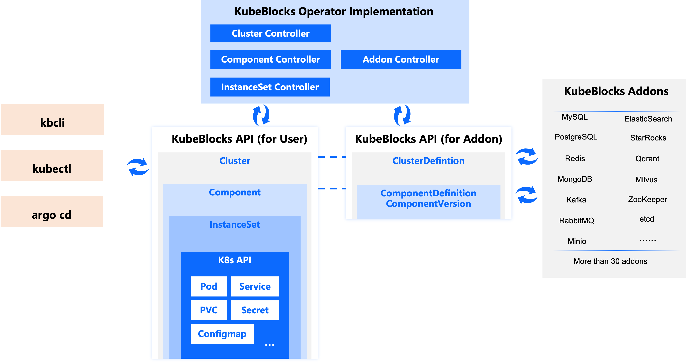

# 概念

["统一 API 如何降低学习曲线"](./introduction.md#统一的-api-如何降低学习门槛)一节介绍了使用统一 API 表达各种数据库的优势。如果仔细查看这些示例，您会发现示例 YAML 文件中包含两个关键概念：**Cluster（集群）** 和 **Component（组件）**。例如，`test-mysql` 是一个包含名为 `mysql` 组件的集群（组件定义为 `apecloud-mysql`）。`test-redis` 也是一个集群，包含两个组件：一个是 `redis`（组件定义为 `redis-7`），有两个副本；另一个是 `redis-sentinel`（组件定义为 `redis-sentinel`），有三个副本。

本文档将解释这两个概念背后的原因，并简要介绍其背后的 API（即 CRD, Custom Resource Definition）。

## KubeBlocks 分层 API 的设计动机

在 KubeBlocks 中，为了通过统一 API 支持各种数据库的管理，我们需要抽象不同数据库的拓扑结构和特性。

我们观察到，生产环境中部署的数据库系统通常采用由多个组件组成的拓扑结构。例如，一个生产环境中的 MySQL 集群可能包括多个代理节点（如 ProxySQL、MaxScale、Vitess、WeScale 等）和多个 MySQL 服务器节点（如 MySQL 社区版、Percona、MariaDB、ApeCloud MySQL 等），以实现高可用性和读写分离。类似地，Redis 部署通常由一个主节点和多个只读副本组成，并通过 Sentinel 管理以确保高可用性。一些用户甚至使用 twemproxy 进行水平分片，以实现更大的容量和吞吐量。

这种模块化方法在分布式数据库系统中尤为常见，整个系统被划分为职责明确的独立组件，如数据存储、查询处理、事务管理、日志记录和元数据管理等。这些组件通过网络进行交互，确保系统能够像单节点数据库一样提供强一致性和事务保障，并实现负载均衡、分布式事务以及具备故障切换能力的灾难恢复等复杂操作。

因此，KubeBlocks 采用了分层 API（即 CRD）的设计，由 **Cluster（集群）** 和 **Component（组件）** 组成，以适应数据库系统的多组件、高度可变的部署拓扑结构。这些抽象允许我们灵活地表达和管理部署在 Kubernetes 上的各种数据库系统拓扑，并根据所需拓扑轻松地将组件组装成集群。

组件是组成集群的积木块。事实上，数据库引擎插件开发者可以在 ClusterDefinition 中定义如何将多个组件组装成不同的拓扑结构。如果您只是普通用户，则无需过度关注 ClusterDefinition 的细节；您只需要知道 KubeBlocks 的插件可以提供不同的拓扑结构选择。例如，Redis 引擎插件支持三种拓扑："standalone"（单机），"replication"（主从复制）和 "replication-twemproxy"（主从复制 + twemproxy）。您可以在创建集群时指定所需的拓扑。

以下是通过 `clusterDefinitionRef` 和 `topology` 创建 Redis 集群的示例：

```yaml
apiVersion: apps.kubeblocks.io/v1alpha1
kind: Cluster
metadata:
  name: test-redis-use-topology
  namespace: default
spec:
  clusterDefinitionRef: redis
  topology: replication
  terminationPolicy: Delete
  componentSpecs:
  - name: redis
    replicas: 2
    disableExporter: true
    resources:
      limits:
        cpu: '0.5'
        memory: 0.5Gi
      requests:
        cpu: '0.5'
        memory: 0.5Gi
    volumeClaimTemplates:
    - name: data
      spec:
        accessModes:
        - ReadWriteOnce
        resources:
          requests:
            storage: 10Gi
  - name: redis-sentinel
    replicas: 3
    resources:
      limits:
        cpu: '0.5'
        memory: 0.5Gi
      requests:
        cpu: '0.5'
        memory: 0.5Gi
    volumeClaimTemplates:
      - name: data
        spec:
          accessModes:
            - ReadWriteOnce
          resources:
            requests:
              storage: 10Gi
```

仔细看上面这个 YAML 文件，可以发现，通过在集群中指定 `clusterDefinitionRef` 和 `topology`，则无需再为每个组件指定 `componentDef`。

借助 Component API，KubeBlocks 将数据库容器打包成标准化的积木块，这些积木块可以根据指定的拓扑组装成数据库集群，并运行在 Kubernetes 上。我们认为这个过程很像用乐高积木搭建东西，这也是 KubeBlocks 这一名字的来源。

## 深入了解 KubeBlocks API

下图展示了 KubeBlocks 的主要 CRD，这里特别强调了 API 的分层结构。其他重要的 API，如 OpsRequest、Backup 和 Restore，并未包含在此图中。下图重点关注分层结构，图表展示更加清晰。我们将在其他文档中解释其他重要的 API。



KubeBlocks 的 CRD 可分为两大类：用户使用的 CRD 和 插件 CRD。

**用户使用的 CRD**

用户使用的 CRD 包括 Cluster、Component 和 InstanceSet。使用 KubeBlocks 创建数据库集群时，将生成以下 CR：

- Cluster 对象：由用户创建。
- Component 对象：KubeBlocks 集群控制器（Cluster Controller）在检测到 Cluster 对象时递归创建的子资源。
- InstanceSet 对象：KubeBlocks 组件控制器（Component Controller）在检测到 Component 对象时递归创建的子资源。InstanceSet 控制器（InstanceSet Controller）随后递归创建 Pod 和 PVC 对象。

**插件 CRD**

插件使用的 CRD 包括 ClusterDefinition、ComponentDefinition 和 ComponentVersion。这些 CR 由数据库引擎插件开发者编写，并捆绑在插件的 Helm chart 中。

:::note

您无需编写 ClusterDefinition 和 ComponentDefinition 的 CR，但仍需要使用这些 CR。如前面创建 Redis Cluster 所示，创建集群时，可以选择在每个组件的 `componentDef` 中指定相应的 ComponentDefinition CR 名称，或者在 `clusterDefinitionRef` 中指定相应的 ClusterDefinition CR 名称，并选择所需的拓扑结构。

:::

### 用户使用的 KubeBlocks API

#### Cluster

Cluster 对象表示由 KubeBlocks 管理的整个数据库集群。一个集群可以包含多个 Component，用户在 Cluster API 中指定每个 Component 的配置，集群控制器将生成并调谐相应的 Component 对象。此外，集群控制器还管理在集群层暴露的所有服务地址。

对于像 Redis Cluster 这种采用无共享架构的分布式数据库，集群对象支持管理多个分片（shard），每个分片由一个单独的 Component 管理。这种架构还支持动态分片（dynamic resharding）：如果需要扩展并添加新分片，只需添加一个新的 Component；反之，如果需要缩减分片数量，则移除相应的 Component。

#### Component

Component 是集群对象的基本模块。例如，一个 Redis 集群可以包含 redis、sentinel，也可能包含代理组件，如 twemproxy。

Component 对象负责管理 Component 内所有副本的生命周期，支持多种操作，包括实例的创建、停止、重启、终止、升级、配置变更、垂直和水平扩展、故障切换、主备切换、调度配置、服务暴露、系统账号管理等。

Component 是从用户提交的 Cluster 对象派生的内部子对象，主要供 KubeBlocks 控制器使用，不建议用户直接修改 Component 对象，应仅用于监控 Component 状态。

#### InstanceSet

从 KubeBlocks v0.9 开始，KubeBlocks 用 InstanceSet 替代 StatefulSet。

一个数据库实例（或副本）由一个 Pod 和其他辅助对象（如 PVC、Service、ConfigMap、Secret）组成。InstanceSet 是一个负责管理实例组的工作负载 CRD。在 KubeBlocks 中，所有工作负载最终都由 InstanceSet 管理。与 Kubernetes 原生的工作负载 CRD（如 StatefulSet 和 Deployment）相比，InstanceSet 融入了更多针对数据库领域的设计和考量，例如每个副本的角色、高可用性需求，以及对特定节点进行下线等操作的支持。

### KubeBlocks Addon API

:::note

只有引擎插件开发者需要了解 ClusterDefinition 和 ComponentDefinition API，普通用户可以跳过这部分内容。

:::

#### ClusterDefinition

ClusterDefinition 是用于定义数据库集群所有可用拓扑的 API，提供了多种拓扑配置以满足不同的部署需求和场景。

每个拓扑都包含一个组件列表，每个组件都关联到一个 ComponentDefinition，提升了复用性并减少了冗余。例如，常用组件如 etcd 和 ZooKeeper 的 ComponentDefinition 可以只定义一次，实现在多个 ClusterDefinition 中复用，从而简化新系统的设置。

此外，ClusterDefinition 还指定了组件的启动、升级和关闭顺序，确保组件生命周期的可控管理。

#### ComponentDefinition

ComponentDefinition 是用于创建组件的可复用蓝图或模板，封装了组件描述、Pod 模板、配置文件模板、脚本、参数列表、环境变量及其来源、事件处理程序等必要的静态设置。ComponentDefinition 与 Component 的动态设置结合，在创建集群时实例化组件。

ComponentDefinition 可以定义的关键内容包括：

- PodSpec 模板：指定组件使用的 PodSpec 模板。
- 配置模板：指定组件所需的配置文件模板。
- 脚本：提供管理组件所需的脚本。
- 存储卷：指定组件的存储卷及其配置。
- Pod 角色：定义组件内 Pod 的各种角色及其能力。
- 暴露的 Kubernetes 服务：指定组件需要暴露的服务。
- 系统账户：定义组件所需的系统账户。

ComponentDefinition 还支持定义组件对事件的响应行为，例如成员加入/离开、组件添加/删除、角色变更、切换等。这使得可以自动处理事件，从而封装组件的复杂行为。

## 插件（Addon）是什么

KubeBlocks 使用插件（Addon）机制来扩展对不同数据库引擎的支持。插件是某个特定数据库引擎的扩展，例如 MySQL Addon、PostgreSQL Addon、Redis Addon、MongoDB Addon 和 Kafka Addon。目前 KubeBlocks 提供了超过 30 种数据库引擎插件。

一个引擎插件包含基于 ClusterDefinition、ComponentDefinition 和 ComponentVersion CRD 的自定义资源（CR），以及一些 ConfigMap（用作配置模板或脚本文件模板）、脚本文件、定义备份和恢复操作的自定义资源和 Grafana 仪表板 JSON 对象。

KubeBlocks 的引擎插件将以 Helm chart 的形式打包和安装。用户安装某个数据库引擎插件后，可以在创建集群时引用该插件中包含的 ClusterDefinition CR 和 ComponentDefinition CR，从而创建相应数据库引擎的集群。
