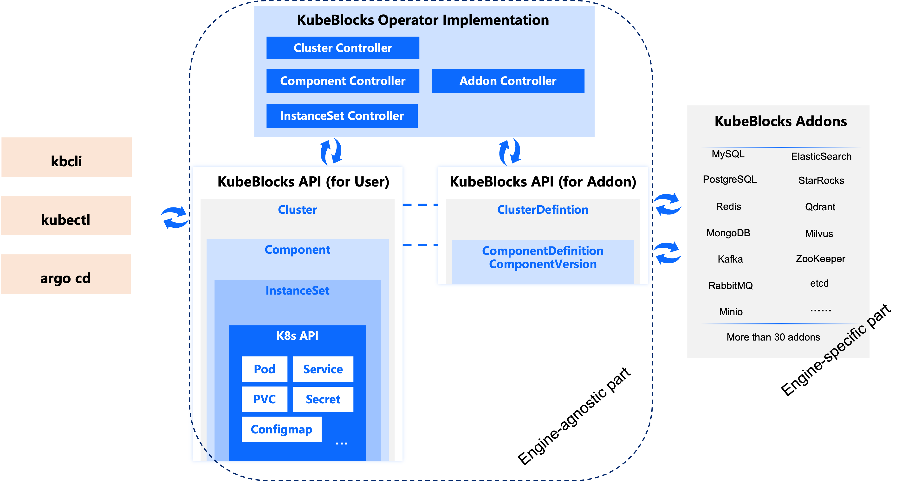
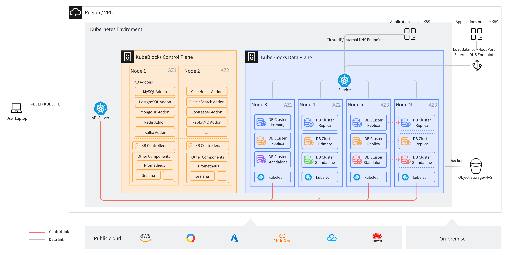

import Tabs from '@theme/Tabs';
import TabItem from '@theme/TabItem';

# KubeBlocks 简介

## KubeBlocks 是什么？

KubeBlocks 是一个开源的 Kubernetes 数据库 operator，能够帮助用户在 Kubernetes 上运行和管理多种类型的数据库。据我们所知，大多数数据库 operator 通常只能管理某种特定类型的数据库，例如：

- CloudNativePG、Zalando、CrunchyData、StackGres operator 用于管理 PostgreSQL。
- Strimzi 用于管理 Kafka。
- Oracle 和 Percona MySQL operator 用于管理 MySQL。

而 KubeBlocks 是一个通用的数据库 operator。这意味着在设计 KubeBlocks API 时，我们并没有将其与某种特定类型的数据库绑定。恰恰相反，我们抽象了各种数据库的通用特性，最终得到了一个通用的、与数据库引擎无关的 API。因此，围绕这个抽象 API 开发的 operator 实现也与具体的数据库引擎无关。



在上图中，Cluster、Component 和 InstanceSet 都是 KubeBlocks 提供的 CRD（自定义资源定义，Custom Resource Definition）。可参阅 [KubeBlocks 概念文档](./concept.md)，了解更多细节。

KubeBlocks 提供了插件（Addon）API，支持集成各种数据库。例如，我们目前提供了以下 KubeBlocks 引擎插件，支持各类主流开源数据库引擎：

- MySQL
- PostgreSQL
- Redis
- MongoDB
- Kafka
- RabbitMQ
- MinIO
- Elasticsearch
- StarRocks
- Qdrant
- Milvus
- ZooKeeper
- etcd
- ...

您可参阅 [KubeBlocks 支持的数据库引擎插件表格](./database-engines-supported.md)，查看支持的引擎及其功能的详细信息。

凭借统一的 API，KubeBlocks 成为在 Kubernetes 上运行多种数据库的绝佳选择，可显著降低掌握多个 operator 所需的学习门槛。

## 统一的 API 如何降低学习门槛

以下是使用 KubeBlocks Cluster API 编写 YAML 文件并创建一个 MySQL 三副本集群的示例。

```yaml
apiVersion: apps.kubeblocks.io/v1alpha1
kind: Cluster
metadata:
  name: test-mysql
  namespace: default
spec:
  terminationPolicy: Delete
  componentSpecs:
  - name: mysql
    componentDef: apecloud-mysql
    replicas: 3
    resources:
      limits:
        cpu: '0.5'
        memory: 0.5Gi
      requests:
        cpu: '0.5'
        memory: 0.5Gi
    volumeClaimTemplates:
    - name: data
      spec:
        accessModes:
        - ReadWriteOnce
        resources:
          requests:
            storage: 10Gi
```

然后，见证奇迹的时刻到了：只需对某些字段进行少量修改，就可以创建一个 PostgreSQL 两副本集群。同样的方法也适用于 MongoDB 和 Redis。Redis YAML 文件稍长一些，因为它创建了两个组件：redis-server 和 sentinel。而且这种方法可以适用于多种引擎。

<Tabs>

<TabItem value="PostgreSQL" label="PostgreSQL" default>

```yaml
apiVersion: apps.kubeblocks.io/v1alpha1
kind: Cluster
metadata:
  name: test-postgresql
  namespace: default
spec:
  terminationPolicy: Delete
  componentSpecs:
  - name: postgresql
    componentDef: postgresql
    replicas: 2
    resources:
      limits:
        cpu: '0.5'
        memory: 0.5Gi
      requests:
        cpu: '0.5'
        memory: 0.5Gi
    volumeClaimTemplates:
    - name: data
      spec:
        accessModes:
        - ReadWriteOnce
        resources:
          requests:
            storage: 10Gi
```

</TabItem>

<TabItem value="MongoDB" label="MongoDB">

```yaml
apiVersion: apps.kubeblocks.io/v1alpha1
kind: Cluster
metadata:
  name: test-mongodb
  namespace: default
spec:
  terminationPolicy: Delete
  componentSpecs:
  - name: mongodb
    componentDef: mongodb
    replicas: 3
    resources:
      limits:
        cpu: '0.5'
        memory: 0.5Gi
      requests:
        cpu: '0.5'
        memory: 0.5Gi
    volumeClaimTemplates:
    - name: data
      spec:
        accessModes:
        - ReadWriteOnce
        resources:
          requests:
            storage: 10Gi
```

</TabItem>

<TabItem value="Redis" label="Redis">

```yaml
apiVersion: apps.kubeblocks.io/v1alpha1
kind: Cluster
metadata:
  name: test-redis
  namespace: default
spec:
  terminationPolicy: Delete
  componentSpecs:
  - name: redis
    componentDef: redis-7
    replicas: 2
    resources:
      limits:
        cpu: '0.5'
        memory: 0.5Gi
      requests:
        cpu: '0.5'
        memory: 0.5Gi
    volumeClaimTemplates:
    - name: data
      spec:
        accessModes:
        - ReadWriteOnce
        resources:
          requests:
            storage: 10Gi
  - name: redis-sentinel
    componentDef: redis-sentinel
    replicas: 3
    resources:
      limits:
        cpu: '0.5'
        memory: 0.5Gi
      requests:
        cpu: '0.5'
        memory: 0.5Gi
    volumeClaimTemplates:
      - name: data
        spec:
          accessModes:
            - ReadWriteOnce
          resources:
            requests:
              storage: 10Gi
```

</TabItem>

</Tabs>

统一的 API 意味着在 Kubernetes 上管理多种数据库变得简单、高效且标准化，这为您节省了大量原本需要花在查找手册和 API 参考文档上的时间。

## 关键特性

- 创建和销毁数据库集群。
- 启动、停止和重启数据库集群。
- 创建集群时，支持选择引擎插件提供的部署拓扑结构，例如，Redis 提供了基于 Sentinel 的读写分离或 Redis 集群拓扑；MySQL 提供了 Proxy 拓扑，可实现读写分离和高可用解决方案，如内置的 Raft 共识插件、外部 etcd 作为协调器，或 Orchestrator。
- 支持在单个数据库集群中为多个副本分别配置不同的资源。例如，在一个 MySQL 集群中，主实例使用 8 个 CPU，而读副本使用 4 个 CPU。反观 Kubernetes 的 StatefulSet 则不支持这一能力。
- 灵活的网络管理：
  - 以动态的方式将数据库访问端点暴露为服务（ClusterIP、LoadBalancer、NodePort）。
  - 支持 HostNetwork。
  - 部分数据库支持通过 Smart Client 进行访问，该客户端会根据服务器返回的节点地址，将请求重新定向到其他节点或支持处理读写分离。Redis、MongoDB 及 Kafka 支持 Smart Client 访问模式。此外，部分数据库还支持实现副本间自动故障转移的客户端，如 etcd。对于这些数据库，KubeBlocks 还支持为每个 Pod （Pod Service）分配服务地址。
- 支持丰富的 Day-2 运维操作：
  - 水平伸缩（增加和减少副本数量）
  - 变配（调整每个副本的 CPU 和内存资源）
  - PVC 卷容量扩展
  - 备份和恢复功能
  - 配置变更（如果技术上存在可能，也支持热加载）
  - 参数修改
  - 主备切换
  - 滚动升级
  - 指定副本下线
  - 小版本升级
- 除了声明式 API 之外，KubeBlocks 还提供了 Ops API，用于在数据库集群上执行一次性运维任务。Ops API 还支持其他功能，如排队、并发控制、进度跟踪和操作回滚。
- 可观测性：支持与 Prometheus 和 Grafana 集成。
- KubeBlocks 提供了功能强大且直观的命令行工具 `kbcli`，使得在 Kubernetes 上操作 KubeBlocks CRs 更加简单，减少输入命令行的次数。对于熟悉 Kubernetes 的用户，也可以搭配 `kubectl` 使用 `kbcli`，用更简单的方式执行运维操作。

## 部署架构

下图展示了在云环境中部署 KubeBlocks 的典型架构图。

Kubernetes 应部署在节点间可以通过网络相互通信的环境中（例如，在一个 VPC 内）。KubeBlocks operator 部署在专用的命名空间（kb-system）中，而数据库实例则部署在用户指定的命名空间中。

在生产环境中，我们建议将 KubeBlocks operator 与数据库部署在不同的节点上（如果您也安装了Prometheus 和 Grafana，建议同样操作）。默认情况下，KubeBlocks 使用反亲和性规则调度数据库集群的多个副本，实现副本在不同节点上运行，以确保高可用性。用户还可以配置可用区（AZ）级别的反亲和性，以便将数据库副本分布在不同的可用区中，从而增强灾难恢复能力。

每个数据库副本在各自的 Pod 中运行。除了运行数据库进程的容器外，Pod 还包括几个辅助容器：一个名为 `lorry` 的容器（从 KubeBlocks v1.0 开始将更名为 kbagent），用于执行 KubeBlocks 控制器（controller）的 Action 命令；另一个名为 `config-manager` 的容器（从 KubeBlocks v1.0 开始会合并到 kbagent 中），用于管理数据库配置文件并支持热更新。此外，数据库引擎插件也可能会有一个 exporter 容器，用于收集 Prometheus 监控所需的指标。


