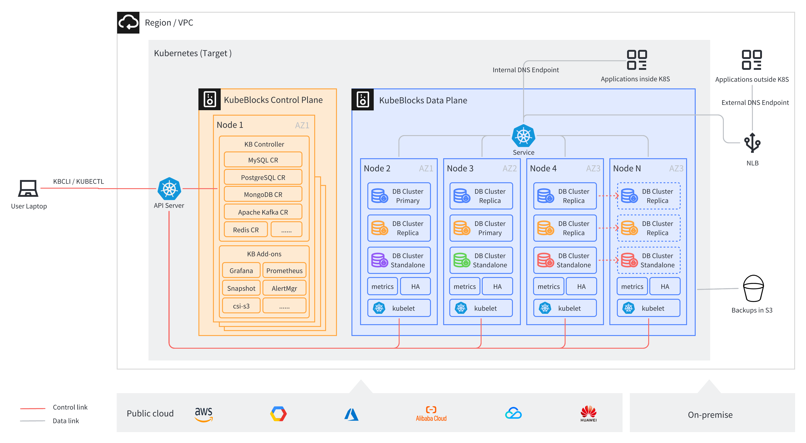

# KubeBlocks 简介

## KubeBlocks 是什么？

KubeBlocks 是基于 Kubernetes 的云原生数据基础设施，将顶级云服务提供商的大规模生产经验与增强的可用性和稳定性改进相结合，帮助用户轻松构建容器化、声明式的关系型、NoSQL、流计算和向量型数据库服务。

KubeBlocks 的名字源自 Kubernetes（K8s）和乐高积木，致力于让 K8s 上的数据基础设施管理就像搭乐高积木一样，既高效又有趣。

## 为什么需要 KubeBlocks？

Kubernetes 已经成为容器编排的事实标准。它利用 ReplicaSet 提供的可扩展性和可用性以及 Deployment 提供的推出和回滚功能来管理日益增加的无状态工作负载。然而，管理有状态工作负载给 Kubernetes 带来了巨大的挑战。尽管 StatefulSet 提供了稳定的持久存储和唯一的网络标识符，但这些功能对于复杂的有状态工作负载来说远远不够。

为了应对这些挑战，并解决复杂性问题，KubeBlocks 引入了 ReplicationSet 和 ConsensusSet，具备以下能力：
- 基于角色的更新顺序可减少因升级版本、缩放和重新启动而导致的停机时间。
- 维护数据复制的状态，并自动修复复制错误或延迟。

## 主要功能

- 支持多云，与 AWS、GCP、Azure、阿里云等云平台兼容。
- 支持 MySQL、PostgreSQL、Redis、MongoDB、Kafka 等 32 个主流数据库和流计算引擎。
- 提供生产级性能、弹性、可扩展性和可观察性。
- 简化 day-2 操作，例如升级、扩展、监控、备份和恢复。
- 包含强大且直观的命令行工具。
- 仅需几分钟，即可建立一个适用于生产环境的完整数据基础设施。

## 架构

