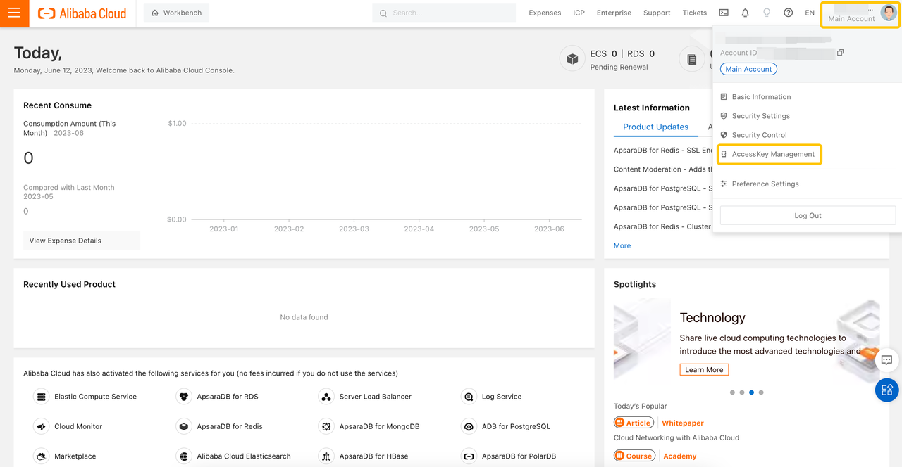
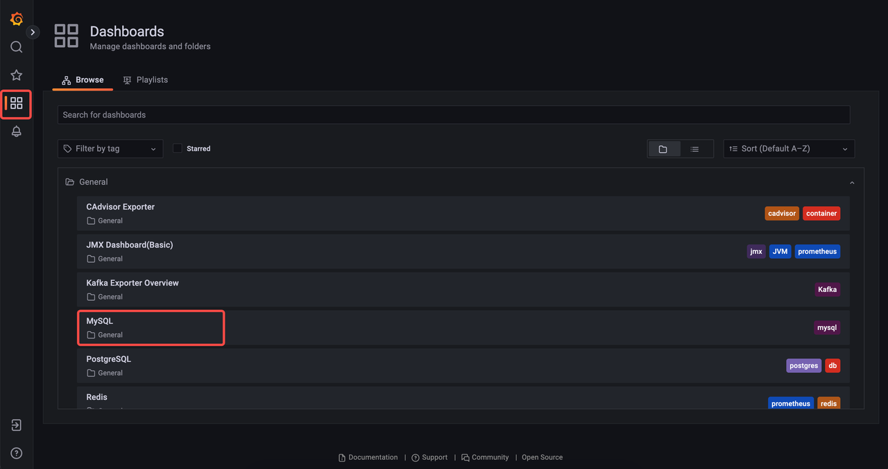
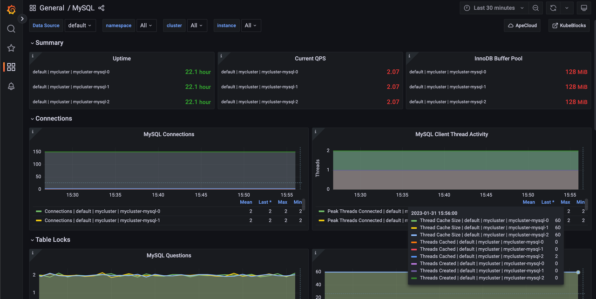

import Tabs from '@theme/Tabs';
import TabItem from '@theme/TabItem';

# 在云上使用 KubeBlocks

本文档将引导你快速上手 KubeBlocks，并演示如何通过命令创建演示环境（Playground）。

## 准备工作

在云上部署需要使用 [Terraform 脚本](https://github.com/apecloud/cloud-provider)来初始化云资源。`kbcli` 会自动下载并保存该脚本，然后使用 Terraform 命令来创建一个完全托管的 Kubernetes 集群，并在该集群上部署 KubeBlocks。


<Tabs>
<TabItem value="AWS" label="AWS" default>

### 开始之前

请确保已经：

- [安装 AWS CLI](https://docs.aws.amazon.com/cli/latest/userguide/getting-started-install.html)。
- [安装 kubectl](https://kubernetes.io/docs/tasks/tools/#kubectl)。
- [安装 kbcli](./../installation/install-with-kbcli/install-kbcli.md)。

### 配置访问密钥

**选项 1.** 使用 `aws configure`

填写访问密钥，并执行以下命令进行身份验证。

```bash
aws configure
AWS Access Key ID [None]: YOUR_ACCESS_KEY_ID
AWS Secret Access Key [None]: YOUR_SECRET_ACCESS_KEY
```

你可以参考[配置 AWS CLI](https://docs.aws.amazon.com/cli/latest/userguide/cli-configure-quickstart.html#cli-configure-quickstart-config) 获取详细信息。

**选项 2.** 使用环境变量

```bash
export AWS_ACCESS_KEY_ID="YOUR_ACCESS_KEY_ID"
export AWS_SECRET_ACCESS_KEY="YOUR_SECRET_ACCESS_KEY"
```

### 初始化 Playground

```bash
kbcli playground init --cloud-provider aws --region us-west-2
```
- `cloud-provider` 用于指定云服务商。
- `region` 用于指定部署 Kubernetes 集群的地区。
  你可以在[官方网站](https://aws.amazon.com/about-aws/global-infrastructure/regional-product-services/?nc1=h_ls)上找到地区列表。

在初始化过程中，`kbcli` 会将 [GitHub 仓库](https://github.com/apecloud/cloud-provider)克隆到 `~/.kbcli/playground` 目录，安装 KubeBlocks，并创建一个 MySQL 集群。执行 `kbcli playground init` 命令后，kbcli 会自动将 kubeconfig 的 context 切换到新的 Kubernetes 集群。

执行以下命令以查看创建的集群。

```bash
# 查看 kbcli 版本
kbcli version

# 查看集群列表
kbcli cluster list
```

:::note

整个初始化过程大约需要 20 分钟。如果长时间未安装成功，建议检查网络环境。

:::

</TabItem>
<TabItem value="GCP" label="GCP">

###  开始之前

请确保已经：
- 拥有 Google Cloud 账户。
- [安装 kubectl](https://kubernetes.io/docs/tasks/tools/#kubectl)。
- [安装 kbcli](./../installation/install-with-kbcli/install-kbcli.md)。

### 配置 GCP 环境

***步骤：***

1. 安装 Google Cloud SDK。

   ```bash
   # macOS 安装 brew
   brew install --cask google-cloud-sdk

   # windows
   choco install gcloudsdk
   ```

2. 初始化 GCP。

   ```bash
   gcloud init
   ```

3. 登录 GCP。

   ```bash
   gcloud auth application-default login
   ```

4. 配置 GOOGLE_PROJECT 环境变量，`kbcli playground` 会在该项目中创建 GKE 集群。

   ```bash
   export GOOGLE_PROJECT=<project-name>
   ```

### 初始化 Playground

执行以下命令，在 GCP 的 `us-central1` 地区部署一个 GKE 服务，并安装 KubeBlocks。

```bash
kbcli playground init --cloud-provider gcp --region us-central1
```

* `cloud-provider` 用于指定云服务商。
* `region` 用于指定部署 Kubernetes 集群的地区。

在初始化过程中，`kbcli` 会将 [GitHub 仓库](https://github.com/apecloud/cloud-provider)克隆到目录 `~/.kbcli/playground`，安装 KubeBlocks，并创建一个 MySQL 集群。执行 kbcli playground init 命令后，kbcli 会自动将 kubeconfig 的 context 切换到新的 Kubernetes 集群。

执行以下命令以查看创建的集群。

```bash
# 查看 kbcli 版本
kbcli version

# 查看集群列表 
kbcli cluster list
```

:::note

整个初始化过程大约需要 20 分钟。如果长时间未安装成功，建议检查网络环境。

:::

</TabItem> 
<TabItem value="腾讯云" label="腾讯云">

### 开始之前

请确保已经：
- 拥有腾讯云账户。
- [安装 kubectl](https://kubernetes.io/docs/tasks/tools/#kubectl)。
- [安装 kbcli](./../installation/install-with-kbcli/install-kbcli.md)。

### 配置 TKE 环境

***步骤：***
1. 登录腾讯云。
2. 前往[容器服务控制台](https://console.cloud.tencent.com/tke2)授权资源操作权限。
3. 前往[访问管理控制台](https://console.cloud.tencent.com/cam/overview)-> **访问密钥** -> **API 密钥管理**。点击**创建密钥**来生成一对 Secret ID 和 Secret Key。
4. 将 Secret ID 和 Secret Key 添加到环境变量中。

   ```bash
   export TENCENTCLOUD_SECRET_ID=YOUR_SECRET_ID
   export TENCENTCLOUD_SECRET_KEY=YOUR_SECRET_KEY
   ```

### 初始化 Playground

在腾讯云的 `ap-chengdu` 可用区部署一个 Kubernetes 服务，并安装 KubeBlocks。

```bash
kbcli playground init --cloud-provider tencentcloud --region ap-chengdu
```

- `cloud-provider` 用于指定云服务商。
- `region` 用于指定部署 Kubernetes 集群的地区。

在初始化过程中，`kbcli` 会将 [GitHub 仓库](https://github.com/apecloud/cloud-provider)克隆到目录`~/.kbcli/playground`，安装 KubeBlocks，并创建一个 MySQL 集群。执行 `kbcli playground init` 命令后，kbcli 会自动将 kubeconfig 的 context 切换到新的 Kubernetes 集群。

执行以下命令以查看创建的集群。

```bash
# 查看 kbcli 版本
kbcli version

# 查看集群列表
kbcli cluster list
```

:::note

整个初始化过程大约需要 20 分钟。如果长时间未安装成功，建议检查网络环境。

:::

</TabItem>
<TabItem value="阿里云" label="阿里云">

### 开始之前

请确保已经：
- 拥有阿里云账户。
- [安装 kubectl](https://kubernetes.io/docs/tasks/tools/#kubectl)。
- [安装 kbcli](./../installation/install-with-kbcli/install-kbcli.md)。

### 配置 ACK 环境

***步骤：***
1. 登录阿里云。
2. 按照[首次使用容器服务 Kubernetes 版](https://www.alibabacloud.com/help/en/container-service-for-kubernetes/latest/quick-start-for-first-time-users)，检查是否已激活 ACK 并分配角色。

   :::note

   在中国大陆地区部署阿里云的用户，请参考[相应指南](https://help.aliyun.com/document_detail/161387.htm?spm=a2c4g.85903.0.0.478d2246FdHMGt#task-2470091)。

   :::
3. 点击 [AliyunOOSLifecycleHook4CSRole](https://ram.console.aliyun.com/role/authorize?spm=5176.2020520152.0.0.5b4716ddI6QevL&request=%7B%22ReturnUrl%22%3A%22https%3A%2F%2Fram.console.aliyun.com%22%2C%22Services%22%3A%5B%7B%22Roles%22%3A%5B%7B%22RoleName%22%3A%22AliyunOOSLifecycleHook4CSRole%22%2C%22TemplateId%22%3A%22AliyunOOSLifecycleHook4CSRole%22%7D%5D%2C%22Service%22%3A%22OOS%22%7D%5D%7D)，点击**同意授权**以创建一个 AliyunOOSLifecycleHook4CSRole 角色。

   创建 ACK 集群时，需要创建和管理节点池，因此需要创建 AliyunOOSLifecycleHook4CSRole 角色，为 OOS 运维编排服务授权以访问其他云产品中的资源（详情请参考[官方文档](https://www.alibabacloud.com/help/zh/container-service-for-kubernetes/latest/scale-up-and-down-node-pools)）。
4. 创建 AccessKey ID 和对应的 AccessKey 密钥。
   
   1. 进入[阿里云管理控制台](https://homenew.console.aliyun.com/home/dashboard/ProductAndService)。将鼠标悬停在账户中心处，点击 **AccessKey 管理**。
       
   2. 点击**创建 AccessKey**，创建 AccessKey ID 和对应的 AccessKey 密钥。
   3. 将 AccessKey ID 和 AccessKey 密钥添加到环境变量中，以配置身份授权信息。

      ```bash
      export ALICLOUD_ACCESS_KEY="YOUR_ACCESS_KEY"
      export ALICLOUD_SECRET_KEY="YOUR_SECRET_KEY"
      ```

   :::note

   详情请参考[创建 AccessKey](https://www.alibabacloud.com/help/en/resource-access-management/latest/accesskey-pairs-create-an-accesskey-pair-for-a-ram-user)。

   :::

### 初始化 Playground

执行以下命令，在阿里云的 cn-hangzhou 地区部署一个 ACK 集群，并安装 KubeBlocks。

```bash
kbcli playground init --cloud-provider alicloud --region cn-hangzhou
```
- `cloud-provider` 用于指定云服务商。
- `region` 用于指定部署 Kubernetes 集群的地区。

在初始化过程中，`kbcli` 会将 [GitHub 仓库](https://github.com/apecloud/cloud-provider)克隆到目录`~/.kbcli/playground`，安装 KubeBlocks，并创建一个 MySQL 集群。执行 `kbcli playground init` 命令后，kbcli 会自动将 kubeconfig 的当前 context 切换到新的 Kubernetes 集群。

执行以下命令以查看创建的集群。

```bash
# 查看 kbcli 版本
kbcli version

# 查看集群列表
kbcli cluster list
```

:::note

整个初始化过程大约需要 20 分钟。如果长时间未安装成功，建议检查网络环境。

:::

</TabItem>
</Tabs>

## 在 Playground 中使用 KubeBlocks

你可以根据以下说明，体验 KubeBlocks 的基本功能。

### 查看 MySQL 集群

***步骤：***

1. 查看数据库集群列表。

    ```bash
    kbcli cluster list
    ```

2. 查看数据库集群的详细信息，比如 `STATUS`，`Endpoints`，`Topology`，`Images` 和 `Events`。

    ```bash
    kbcli cluster describe mycluster
    ```

### 访问 MySQL 集群

**选项 1.** 通过容器网络连接数据库

等待该集群的状态变为 `Running`，然后执行 `kbcli cluster connect` 来访问指定的数据库集群。例如:

```bash
kbcli cluster connect mycluster
```

**选项 2.** 远程连接数据库

***步骤：***

1. 获取连接凭证。

   ```bash
   kbcli cluster connect --show-example --client=cli mycluster
   ```
2. 执行 `port-forward`。

   ```bash
   kubectl port-forward service/mycluster-mysql 3306:3306
   >
   Forwarding from 127.0.0.1:3306 -> 3306
   Forwarding from [::1]:3306 -> 3306
   ```
3. 打开一个新的终端，连接数据库集群。

   ```bash
   mysql -h 127.0.0.1 -P 3306 -u root -p"******"
   >
   ...
   Type 'help;' or '\h' for help. Type '\c' to clear the current input statement.

   mysql> show databases;
   >
   +--------------------+
   | Database           |
   +--------------------+
   | information_schema |
   | mydb               |
   | mysql              |
   | performance_schema |
   | sys                |
   +--------------------+
   5 rows in set (0.02 sec)
   ```

### 观测 MySQL 集群

KubeBlocks 具备完整的可观测性能力，下面主要演示其中的监控功能。

***步骤：***

1. 打开 Grafana 仪表盘。

   ```bash
   kbcli dashboard open kubeblocks-grafana
   ```

   ***结果***

   命令执行后，将自动加载出 Grafana 网站的监控页面。


2. 点击左侧栏的仪表盘图标，页面上会显示两个监控面板。
   

3. 点击 **General** -> **MySQL**，监控 Playground 创建的 MySQL 集群的状态。
   

### MySQL 的高可用性

下面通过简单的故障模拟，展示 MySQL 的故障恢复能力。

#### 删除 MySQL 单机版

首先删除 MySQL 单机版。

```bash
kbcli cluster delete mycluster
```

#### 创建 MySQL 集群版

使用 `kbcli` 创建一个 MySQL 集群版，下面使用默认配置创建：

```bash
kbcli cluster create --cluster-definition='apecloud-mysql' --set replicas=3
```

#### 模拟 Leader Pod 故障恢复

下面通过删除 Leader Pod 来模拟故障。

***步骤:***

1. 确保新创建的集群状态为 `Running`。

   ```bash
   kbcli cluster list
   ```

2. 在 `Topology` 中找到 Leader Pod 的名称。在这个示例中，Leader Pod 的名称是 maple05-mysql-1。

   ```bash
   kbcli cluster describe maple05
   >
   Name: maple05         Created Time: Jan 27,2023 17:33 UTC+0800
   NAMESPACE        CLUSTER-DEFINITION        VERSION                STATUS         TERMINATION-POLICY
   default          apecloud-mysql            ac-mysql-8.0.30        Running        WipeOut

   Endpoints:
   COMPONENT        MODE             INTERNAL                EXTERNAL
   mysql            ReadWrite        10.43.29.51:3306        <none>

   Topology:
   COMPONENT        INSTANCE               ROLE            STATUS         AZ            NODE                                                 CREATED-TIME
   mysql            maple05-mysql-1        leader          Running        <none>        k3d-kubeblocks-playground-server-0/172.20.0.3        Jan 30,2023 17:33 UTC+0800
   mysql            maple05-mysql-2        follower        Running        <none>        k3d-kubeblocks-playground-server-0/172.20.0.3        Jan 30,2023 17:33 UTC+0800
   mysql            maple05-mysql-0        follower        Running        <none>        k3d-kubeblocks-playground-server-0/172.20.0.3        Jan 30,2023 17:33 UTC+0800

   Resources Allocation:
   COMPONENT        DEDICATED        CPU(REQUEST/LIMIT)        MEMORY(REQUEST/LIMIT)        STORAGE-SIZE        STORAGE-CLASS
   mysql            false            <none>                    <none>                       <none>              <none>

   Images:
   COMPONENT        TYPE         IMAGE
   mysql            mysql        docker.io/apecloud/wesql-server:8.0.30-5.alpha2.20230105.gd6b8719

   Events(last 5 warnings, see more:kbcli cluster list-events -n default mycluster):
   TIME        TYPE        REASON        OBJECT        MESSAGE
   ```

3. 删除 Leader Pod。

   ```bash
   kubectl delete pod maple05-mysql-1
   >
   pod "maple05-mysql-1" deleted
   ```

4. 连接 MySQL 集群版，只需几秒就可成功。

   ```bash
   kbcli cluster connect maple05
   >
   Connect to instance maple05-mysql-2: out of maple05-mysql-2(leader), maple05-mysql-1(follower), maple05-mysql-0(follower)
   Welcome to the MySQL monitor.  Commands end with ; or \g.
   Your MySQL connection id is 33
   Server version: 8.0.30 WeSQL Server - GPL, Release 5, Revision d6b8719

   Copyright (c) 2000, 2022, Oracle and/or its affiliates.

   Oracle is a registered trademark of Oracle Corporation and/or its
   affiliates. Other names may be trademarks of their respective
   owners.

   Type 'help;' or '\h' for help. Type '\c' to clear the current input statement.

   mysql>
   ```

## 销毁 Playground

1. 在销毁 Playground 之前，建议删除 KubeBlocks 创建的数据库集群。

   ```bash
   # 查看所有集群
   kbcli cluster list -A

   # 删除一个集群
   # 需要进行二次确认，或者可以添加 --auto-approve 自动确认
   kbcli cluster delete <name>

   # 卸载 KubeBlocks
   # 需要进行二次确认，或者可以添加 --auto-approve 自动确认
   kbcli kubeblocks uninstall --remove-pvcs --remove-pvs
   ```

2. 销毁 Playground。

   ```bash
   kbcli playground destroy 
   ```

:::caution

`kbcli playground destroy` 会直接销毁云上的 Kubernetes 集群。但是云上可能还有一些残留资源，例如卷和快照等。请及时删除，避免不必要的费用。
:::
