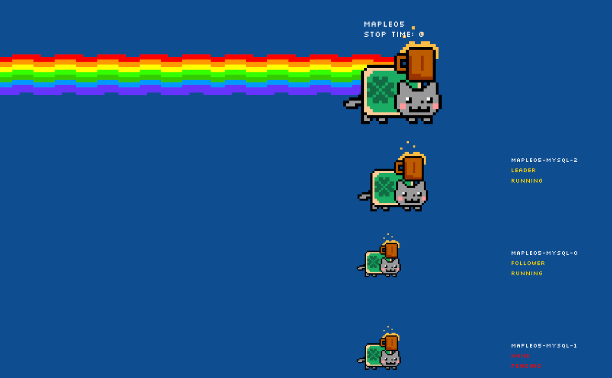

# 在本地使用 KubeBlocks

本文档将引导你快速入门 KubeBlocks，并演示如何通过命令创建演示环境（Playground）。

## 准备工作

在开始之前，请确保已经满足以下条件。

* 系统最低要求：

  * CPU：4 核，可使用 `sysctl hw.physicalcpu` 命令查看 CPU；
  * RAM：4 GB，使用 `top -d` 命令查看内存。

* 在电脑上已安装：
  * [Docker](https://docs.docker.com/get-docker/)：v20.10.5（runc ≥ v1.0.0-rc93）或更高版本；
  * [kubectl](https://kubernetes.io/docs/tasks/tools/#kubectl)：用于与 Kubernetes 集群进行交互；
  * [kbcli](./../installation/install-with-kbcli/install-kbcli.md)：用于 Playground 和 KubeBlocks 之间的交互。

## 初始化 Playground

***步骤：***

1. 安装 Playground。

   ```bash
   kbcli playground init
   ```

   该命令执行以下操作：
   1. 在使用 [K3d](https://k3d.io/v5.4.6/) 的容器中创建一个 Kubernetes 集群。
   2. 在 K3d 集群中部署 KubeBlocks。
   3. 创建 MySQL 单机版集群。

   :::note

   * 如果之前执行过 `kbcli playground init` 但是失败了，再次执行该命令可能会导致报错。请先执行 `kbcli playground destroy` 清理环境，再执行 `kbcli playground init`。
   * 如果在 Windows 上执行 Playground 并报以下错误，这是因为受到了 Windows 11 的安全策略的影响。你操作的 `kbcli.exe` 可能经过第三方篡改（或者是你在 Windows 上通过 source build 出的 kbcli）。
   
   ```bash
   error: failed to set up k3d cluster: failed to create k3d cluster kb-playground: Failed Cluster Start: Failed to start server k3d-kb-playground-server-0: Node k3d-kb-playground-server-0 failed to get ready: error waiting for log line `k3s is up and running` from node 'k3d-kb-playground-server-0': stopped returning log lines
   ```

      解决方案：
      1. 卸载或删除当前的 `kbcli.exe` 文件。
      2. 使用 `winget` 下载最新的 kbcli，或者访问 KubeBlocks 的 [GitHub 发布页面](https://github.com/apecloud/kubeblocks/releases)重新下载 kbcli。
   :::

2. 反复检查 MySQL 集群，直到状态变为 `Running`。

   ```bash
   kbcli cluster list
   ```

   ***结果***

   在默认命名空间中创建了一个名为 `mycluster` 的集群，你可以在安装成功的提示语下可以看到用户指南。执行 `kbcli playground init -h` 可以再次查看此指南。

## 在 Playground 中使用 KubeBlocks

现在就可以开启你的 KubeBlocks 之旅了。你可以尝试 KubeBlocks的基本功能，包括[查看 MySQL 集群](#查看-mysql-集群)、[访问 MySQL 集群](#访问-mysql-集群)、[观测 MySQL 集群](#观测-mysql-集群)和 [MySQL 的高可用性](#mysql-的高可用性)等等。

### 查看 MySQL 集群

***步骤：***

1. 查看数据库集群列表。

    ```bash
    kbcli cluster list
    ```

2. 查看集群的详细信息，例如 `STATUS`、`Endpoints`、`Topology`、`Images` 和 `Events`。

    ```bash
    kbcli cluster describe mycluster
    ```

### 访问 MySQL 集群

**选项 1.** 通过容器网络连接数据库

等待该集群的状态变为 `Running`，然后执行 `kbcli cluster connect` 来访问指定的数据库集群。例如，

```bash
kbcli cluster connect mycluster
```

**选项 2.** 通过主机网络连接数据库

***步骤：***

1. 获取连接凭证。

   ```bash
   kbcli cluster connect --show-example --client=cli mycluster
   ```

2. 执行 `port-forward`。

   ```bash
   kubectl port-forward service/mycluster-mysql 3306:3306
   >
   Forwarding from 127.0.0.1:3306 -> 3306
   Forwarding from [::1]:3306 -> 3306
   ```

3. 打开一个新的终端，连接数据库集群。

   ```bash
   mysql -h 127.0.0.1 -P 3306 -u root -paiImelyt
   >
   ...
   Type 'help;' or '\h' for help. Type '\c' to clear the current input statement.

   mysql> show databases;
   >
   +--------------------+
   | Database           |
   +--------------------+
   | information_schema |
   | mydb               |
   | mysql              |
   | performance_schema |
   | sys                |
   +--------------------+
   5 rows in set (0.02 sec)
   ```

### 观测 MySQL 集群

KubeBlocks 具备完整的可观测性能力，下面主要演示其中的监控功能。

***步骤:***

1. 打开 Grafana 仪表盘。

   ```bash
   kbcli dashboard open kubeblocks-grafana
   ```

   **结果：**

   命令执行后，将自动加载出 Grafana 网站的监控页面。

2. 点击左侧栏的仪表盘图标，页面上会显示两个监控面板。
   
3. 点击 **General** -> **MySQL**，监控 MySQL 集群的状态。
   

### MySQL 的高可用性

下面通过简单的故障模拟，展示 MySQL 的故障恢复能力。

#### 删除 MySQL 单机版

首先删除 MySQL 单机版。

```bash
kbcli cluster delete mycluster
```

#### 创建 MySQL 集群版

使用 `kbcli` 创建一个 MySQL 集群版，下面使用默认配置创建：

```bash
kbcli cluster create --cluster-definition='apecloud-mysql' --set replicas=3
```

#### 模拟 Leader Pod 故障恢复

下面通过删除 Leader Pod 来模拟故障。

***步骤：***

1. 确保新创建的集群状态为 `Running`。

   ```bash
   kbcli cluster list
   ```

2. 在 `Topology` 中找到 Leader Pod 的名称。在这个示例中，Leader Pod 的名称是 maple05-mysql-1。

   ```bash
   kbcli cluster describe maple05
   >
   Name: maple05         Created Time: Jan 27,2023 17:33 UTC+0800
   NAMESPACE        CLUSTER-DEFINITION        VERSION                STATUS         TERMINATION-POLICY
   default          apecloud-mysql            ac-mysql-8.0.30        Running        WipeOut

   Endpoints:
   COMPONENT        MODE             INTERNAL                EXTERNAL
   mysql            ReadWrite        10.43.29.51:3306        <none>

   Topology:
   COMPONENT        INSTANCE               ROLE            STATUS         AZ            NODE                                                 CREATED-TIME
   mysql            maple05-mysql-1        leader          Running        <none>        k3d-kubeblocks-playground-server-0/172.20.0.3        Jan 30,2023 17:33 UTC+0800
   mysql            maple05-mysql-2        follower        Running        <none>        k3d-kubeblocks-playground-server-0/172.20.0.3        Jan 30,2023 17:33 UTC+0800
   mysql            maple05-mysql-0        follower        Running        <none>        k3d-kubeblocks-playground-server-0/172.20.0.3        Jan 30,2023 17:33 UTC+0800

   Resources Allocation:
   COMPONENT        DEDICATED        CPU(REQUEST/LIMIT)        MEMORY(REQUEST/LIMIT)        STORAGE-SIZE        STORAGE-CLASS
   mysql            false            <none>                    <none>                       <none>              <none>

   Images:
   COMPONENT        TYPE         IMAGE
   mysql            mysql        docker.io/apecloud/wesql-server:8.0.30-5.alpha2.20230105.gd6b8719

   Events(last 5 warnings, see more:kbcli cluster list-events -n default mycluster):
   TIME        TYPE        REASON        OBJECT        MESSAGE
   ```

3. 删除 Leader Pod。

   ```bash
   kubectl delete pod maple05-mysql-1
   >
   pod "maple05-mysql-1" deleted
   ```

4. 连接 MySQL 集群版，只需几秒就可成功。

   ```bash
   kbcli cluster connect maple05
   >
   Connect to instance maple05-mysql-2: out of maple05-mysql-2(leader), maple05-mysql-1(follower), maple05-mysql-0(follower)
   Welcome to the MySQL monitor.  Commands end with ; or \g.
   Your MySQL connection id is 33
   Server version: 8.0.30 WeSQL Server - GPL, Release 5, Revision d6b8719

   Copyright (c) 2000, 2022, Oracle and/or its affiliates.

   Oracle is a registered trademark of Oracle Corporation and/or its
   affiliates. Other names may be trademarks of their respective
   owners.

   Type 'help;' or '\h' for help. Type '\c' to clear the current input statement.

   mysql>
   ```

#### 用彩虹猫演示可用性故障

上面的例子主要使用了 `kbcli cluster connect` 来测试可用性，但我们不容易看到实际发生的变化。

下面用 NON-STOP NYAN CAT 来直观地进行展示。NON-STOP NYAN CAT 是一款 demo 应用程序，用来观察数据库集群异常对业务带来的影响。它提供动画和实时信息展示，可以直观表现数据库服务的可用性影响。

***步骤：***

1. 安装 NYAN CAT demo 程序。

   ```bash
   kbcli addon enable nyancat
   ```

   <details>

   <summary>预期输出</summary>

   ```bash
   addon.extensions.kubeblocks.io/nyancat enabled
   ```

   </details>

2. 检查 NYAN CAT 插件的状态，当状态为 `Enabled` 时，表示该应用程序已准备就绪。

   ```bash
   kbcli addon list | grep nyancat 
   ```

3. 打开网页。

   ```bash
   kbcli dashboard open kubeblocks-nyancat
   ```

4. 在另一个终端选项卡中删除 Leader Pod，然后通过 NYAN CAT 页面查看对集群的影响。

   ```bash
   kubectl delete pod maple05-mysql-1
   ```

   

5. 卸载 NYAN CAT demo 程序。

   ```bash
   kbcli addon disable nyancat
   ```

## 销毁 Playground

销毁 Playground 后，相关资源和数据将被清理：

* 删除所有 KubeBlocks 数据库集群；
* 卸载 KubeBlocks；
* 删除由 K3d 创建的 Kubernetes 集群。

销毁 Playground。

```bash
kbcli playground destroy
```
